# Medical Document AI Assistant
### Final Implementation Documentation — Complete Technical Reference

> **Scope:** Local & globally-accessible implementation across all team systems.
> **Cost:** 100% free-to-use APIs and libraries — no paid services required.
> **Environment:** Designed for seamless use within Antigravity (and standard IDEs).
> **Deployment:** Excluded. This document covers development and local operation only.

---

## Table of Contents

1. [Project Overview](#1-project-overview)
2. [Final Technology Stack](#2-final-technology-stack)
3. [System Architecture](#3-system-architecture)
4. [Complete Data Flow](#4-complete-data-flow)
5. [Environment Setup](#5-environment-setup)
6. [Project Directory Structure](#6-project-directory-structure)
7. [API Keys & Configuration](#7-api-keys--configuration)
8. [Module Specifications](#8-module-specifications)
   - 8.1 [document_parser.py](#81-document_parserpy)
   - 8.2 [extractor.py](#82-extractorpy)
   - 8.3 [rag_engine.py](#83-rag_enginepy)
   - 8.4 [app.py](#84-apppy)
9. [RAG Pipeline — Deep Dive](#9-rag-pipeline--deep-dive)
10. [Embedding Strategy — Voyage AI](#10-embedding-strategy--voyage-ai)
11. [LLM Strategy — Groq + LLaMA 3](#11-llm-strategy--groq--llama-3)
12. [Vector Store — FAISS](#12-vector-store--faiss)
13. [Validation & Confidence Layer](#13-validation--confidence-layer)
14. [Prompt Engineering](#14-prompt-engineering)
15. [State Management in Streamlit](#15-state-management-in-streamlit)
16. [Complete Code Reference](#16-complete-code-reference)
17. [Testing Protocol](#17-testing-protocol)
18. [Known Gotchas & Fixes](#18-known-gotchas--fixes)
19. [AI Agent Prompts for Antigravity](#19-ai-agent-prompts-for-antigravity)
20. [Limitations & Future Scope](#20-limitations--future-scope)

---

## 1. Project Overview

### What This System Does

The **Medical Document AI Assistant** is a fully local, AI-powered healthcare document intelligence platform. It ingests medical PDFs (clinical notes, discharge summaries, lab reports, prescriptions, ICU notes), extracts structured medical data from them, stores them in a semantic vector index, and allows clinicians or developers to query the documents using natural language.

The system does **not** simply search by keyword. It understands *meaning* — powered by medical-grade embeddings from Voyage AI — and generates grounded, context-anchored answers using a Retrieval-Augmented Generation (RAG) pipeline backed by Groq's LLaMA 3.

### Core Capabilities

| Capability | Description |
|---|---|
| PDF Ingestion | Reads and parses any medical PDF |
| Structured NER | Extracts diagnoses, medications, allergies, critical risks via LLM |
| Semantic Search | Medical-grade vector search using Voyage AI embeddings |
| Conversational Q&A | Multi-turn chat with memory over the document |
| Dashboard | Visual display of extracted entities |
| Free Operation | All APIs used have free tiers adequate for development |

### Why This Architecture

No single model handles everything optimally. This system uses a **hybrid strategy**:

- **Voyage AI** for embeddings → specialized for semantic retrieval accuracy
- **Groq + LLaMA 3** for reasoning → fast, free, capable LLM inference
- **FAISS** for vector storage → runs locally in RAM, no external DB needed
- **LangChain** for orchestration → proven RAG patterns, history management
- **Streamlit** for UI → rapid development, no frontend framework needed
- **Pydantic** for structured extraction → guarantees JSON-parseable medical outputs

---

## 2. Final Technology Stack

```
┌─────────────────────────────────────────────────────────────────┐
│                    TECHNOLOGY STACK                             │
├──────────────────────┬──────────────────────────────────────────┤
│  Layer               │  Tool / Library                          │
├──────────────────────┼──────────────────────────────────────────┤
│  Frontend UI         │  Streamlit                               │
│  Orchestration       │  LangChain                               │
│  Document Parsing    │  PyMuPDF (via langchain-community)       │
│  Text Splitting      │  RecursiveCharacterTextSplitter          │
│  Embeddings          │  Voyage AI — voyage-3-lite (Free Tier)  │
│  LLM (Reasoning)     │  Groq — LLaMA 3 8B 8192 (Free Tier)    │
│  Vector Database     │  FAISS-CPU (Local, in-RAM)              │
│  Data Structuring    │  Pydantic v2                             │
│  Env Management      │  python-dotenv                           │
│  Language            │  Python 3.11+                            │
└──────────────────────┴──────────────────────────────────────────┘
```

### Why Each Tool Was Selected

**Streamlit** — Eliminates the need for a separate React/Next.js frontend and FastAPI backend for local use. Runs the entire UI in a single Python script with state management built in.

**LangChain** — Provides battle-tested building blocks: document loaders, text splitters, retrieval chains, history-aware retrievers, and prompt templates. Avoids reinventing RAG from scratch.

**PyMuPDF (fitz)** — Significantly faster and more accurate at extracting text from medical PDFs than alternatives like pypdf or pdfplumber, especially for multi-column layouts and scanned-adjacent documents.

**Voyage AI (voyage-3-lite)** — Voyage AI embeddings are specifically tuned for retrieval tasks and outperform generic embedding models on domain-specific documents. The free tier provides sufficient throughput for local development.

**Groq (LLaMA 3 8B)** — Groq's inference hardware (LPU) makes LLaMA 3 response times nearly instant. The free tier allows generous requests-per-minute for development.

**FAISS-CPU** — Runs entirely in local RAM with no external service. Supports millions of vectors with fast approximate nearest-neighbor search. Persists to disk optionally.

**Pydantic** — Enforces strict output schemas from the LLM during entity extraction, preventing malformed or hallucinated JSON.

---

## 3. System Architecture

### High-Level System Diagram

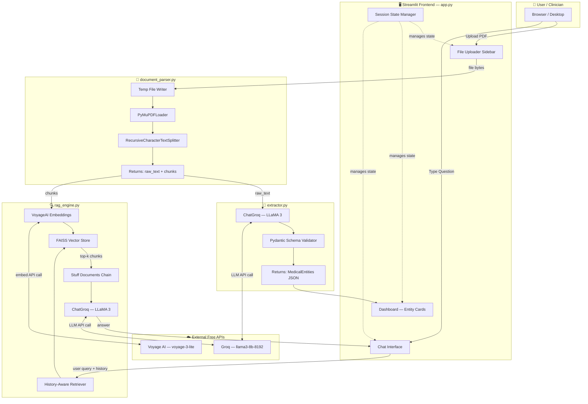

### Component Interaction Map

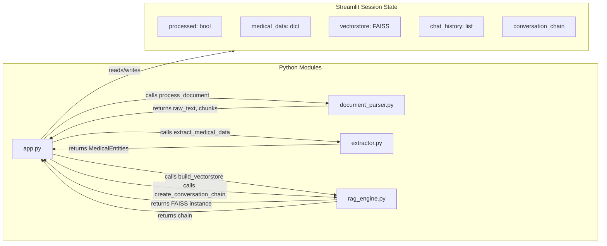

---

## 4. Complete Data Flow

### Phase 1 — Document Ingestion Flow

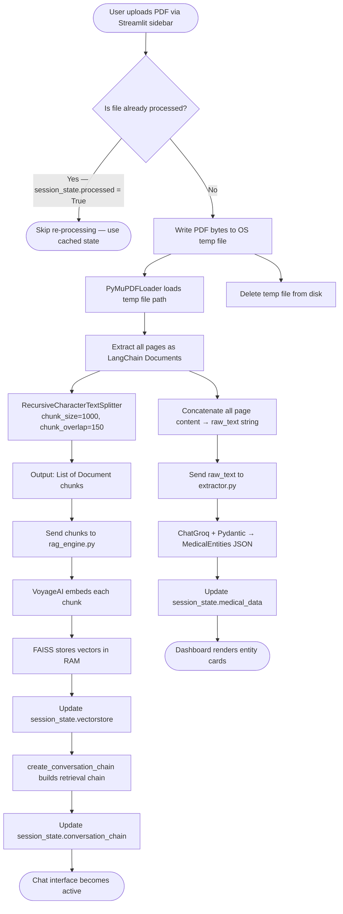

### Phase 2 — Question Answering Flow

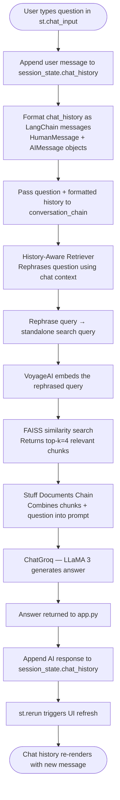

### Phase 3 — Entity Extraction Flow

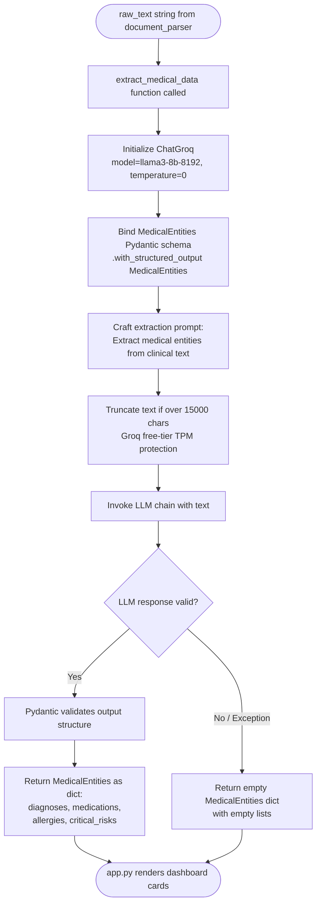

---

## 5. Environment Setup

### Prerequisites

Ensure the following are installed on every machine in the team before proceeding:

```
Python 3.11 or higher
pip (comes with Python)
Git
A code editor (VS Code, Antigravity, Cursor, PyCharm)
```

Verify your Python version:

```bash
python --version
# Should output: Python 3.11.x or higher
```

### Step 1 — Clone or Initialize the Project

If starting from scratch:

```bash
mkdir medical_ai_assistant
cd medical_ai_assistant
git init
```

If cloning from a shared repository:

```bash
git clone <your-team-repo-url>
cd medical_ai_assistant
```

### Step 2 — Create a Virtual Environment

A virtual environment isolates project dependencies from your system Python. **This step is mandatory on every machine.**

```bash
# Create the virtual environment
python -m venv venv
```

Activate it based on your OS:

```bash
# Windows (PowerShell or CMD)
venv\Scripts\activate

# macOS / Linux / WSL
source venv/bin/activate
```

You should now see `(venv)` at the start of your terminal prompt.

> **Antigravity Note:** If working inside Antigravity, open the integrated terminal and run the same commands. Antigravity respects `.venv` directories — the environment will be auto-detected in subsequent sessions.

### Step 3 — Install All Dependencies

Create the file `requirements.txt` in the project root with these exact contents:

```text
streamlit
langchain
langchain-groq
langchain-voyageai
langchain-community
langchain-core
faiss-cpu
pymupdf
pydantic
python-dotenv
```

Then install:

```bash
pip install -r requirements.txt
```

Expected installation time: 2–5 minutes depending on internet speed.

Verify key packages installed correctly:

```bash
pip show langchain langchain-groq langchain-voyageai faiss-cpu pymupdf streamlit
```

### Step 4 — Obtain Free API Keys

You need exactly two API keys. Both have free tiers sufficient for full local development.

#### Groq API Key (LLM Inference)

1. Go to [https://console.groq.com](https://console.groq.com)
2. Sign up or log in (free, no credit card required)
3. Navigate to **API Keys** in the sidebar
4. Click **Create API Key**
5. Copy the key — it starts with `gsk_`

Free tier limits: ~14,400 requests/day on LLaMA 3 8B — more than sufficient.

#### Voyage AI API Key (Embeddings)

1. Go to [https://www.voyageai.com](https://www.voyageai.com)
2. Sign up (free, no credit card required)
3. Navigate to your dashboard and locate **API Keys**
4. Create a new key
5. Copy the key — it starts with `pa_`

Free tier limits: 50 million tokens/month on `voyage-3-lite` — effectively unlimited for development.

### Step 5 — Configure Environment Variables

Create a `.env` file in the **project root directory**:

```bash
# In your terminal (project root)
touch .env   # macOS/Linux
# Windows: create the file manually in your editor
```

Add your keys:

```env
GROQ_API_KEY=gsk_your_actual_groq_key_here
VOYAGE_API_KEY=pa_your_actual_voyage_key_here
```

> ⚠️ **CRITICAL:** Add `.env` to your `.gitignore` immediately. Never commit API keys to version control.

Create or update `.gitignore`:

```gitignore
venv/
.env
__pycache__/
*.pyc
.DS_Store
*.faiss
*.pkl
sample_data/
```

---

## 6. Project Directory Structure

Create this exact folder structure. Every module has a single, clear responsibility. This separation is critical for AI coding agents (Antigravity, Cursor) to correctly understand context without hallucinating cross-module code.

```
medical_ai_assistant/
│
├── app.py                      ← Main Streamlit UI + session state hub
├── document_parser.py          ← PDF loading, text extraction, chunking
├── extractor.py                ← LLM-based NER → structured JSON
├── rag_engine.py               ← FAISS vector store + conversational RAG chain
│
├── requirements.txt            ← All Python dependencies
├── .env                        ← API keys (NOT committed to git)
├── .gitignore                  ← Excludes venv, .env, cache
│
└── sample_data/                ← Test PDFs for local development
    ├── sample_discharge.pdf
    └── sample_cardiology.pdf
```

### Responsibility Matrix

```
┌────────────────────────┬──────────────────────────────────────────────────┐
│  File                  │  Sole Responsibility                             │
├────────────────────────┼──────────────────────────────────────────────────┤
│  app.py                │  UI layout, user interactions, session state,    │
│                        │  orchestrating calls to all other modules        │
├────────────────────────┼──────────────────────────────────────────────────┤
│  document_parser.py    │  Accepting the uploaded file object, writing     │
│                        │  to temp disk, loading with PyMuPDF, splitting   │
│                        │  into chunks, returning text + chunks            │
├────────────────────────┼──────────────────────────────────────────────────┤
│  extractor.py          │  Defining the MedicalEntities Pydantic schema,   │
│                        │  invoking Groq with structured output binding,   │
│                        │  returning validated entity JSON                 │
├────────────────────────┼──────────────────────────────────────────────────┤
│  rag_engine.py         │  Initializing Voyage AI embeddings, building the │
│                        │  FAISS index, creating the history-aware         │
│                        │  conversational retrieval chain                  │
└────────────────────────┴──────────────────────────────────────────────────┘
```

---

## 7. API Keys & Configuration

### How Environment Variables Are Loaded

Every module that needs an API key must load it from the `.env` file using `python-dotenv`. This pattern must be used consistently:

```python
from dotenv import load_dotenv
import os

load_dotenv()  # Reads .env file in project root

GROQ_API_KEY = os.getenv("GROQ_API_KEY")
VOYAGE_API_KEY = os.getenv("VOYAGE_API_KEY")
```

### Configuration Reference Table

```
┌──────────────────────┬──────────────────────┬────────────────────────────┐
│  Variable Name       │  Used In             │  Value Format              │
├──────────────────────┼──────────────────────┼────────────────────────────┤
│  GROQ_API_KEY        │  extractor.py        │  gsk_xxxxxxxxxxxxxxxxxxxx  │
│                      │  rag_engine.py       │                            │
├──────────────────────┼──────────────────────┼────────────────────────────┤
│  VOYAGE_API_KEY      │  rag_engine.py       │  pa_xxxxxxxxxxxxxxxxxxxx   │
└──────────────────────┴──────────────────────┴────────────────────────────┘
```

### Model Configuration Constants

These should be set as constants at the top of the modules that use them. Do not hardcode inside functions.

```python
# In extractor.py and rag_engine.py
GROQ_MODEL = "llama3-8b-8192"
VOYAGE_MODEL = "voyage-3-lite"
GROQ_TEMPERATURE_EXTRACTION = 0      # Zero temperature for deterministic NER
GROQ_TEMPERATURE_QA = 0.1            # Slight warmth for natural Q&A
CHUNK_SIZE = 1000                    # Characters per chunk
CHUNK_OVERLAP = 150                  # Overlap to preserve context at boundaries
RETRIEVAL_K = 4                      # Number of chunks returned per query
MAX_EXTRACTION_CHARS = 15000         # Groq free-tier protection
```

---

## 8. Module Specifications

### 8.1 `document_parser.py`

**Purpose:** Accepts the raw Streamlit uploaded file object, safely writes it to a temporary disk location, uses PyMuPDFLoader to extract text, splits the content into overlapping chunks, then returns both the full concatenated text (for entity extraction) and the list of chunks (for embedding into FAISS).

**Why temp file is needed:** LangChain's `PyMuPDFLoader` requires a physical file path on disk. Streamlit's `UploadedFile` object lives in memory as a byte stream and has no disk path. The fix is to write the bytes to a `tempfile`, process it, then clean up.

**Function Signature:**

```python
def process_document(uploaded_file) -> tuple[str, list]:
    """
    Args:
        uploaded_file: Streamlit UploadedFile object (in-memory bytes)
    
    Returns:
        full_text (str): Entire document as a single concatenated string
        chunks (list): List of LangChain Document objects after splitting
    """
```

**Internal Logic Walkthrough:**

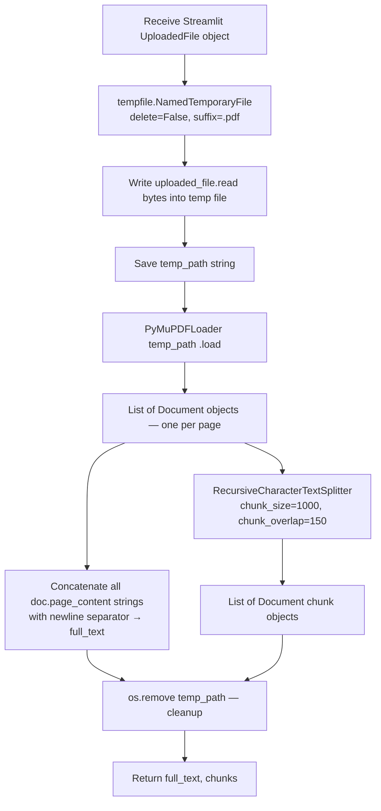

**Complete Implementation:**

```python
# document_parser.py

import tempfile
import os
from langchain_community.document_loaders import PyMuPDFLoader
from langchain.text_splitter import RecursiveCharacterTextSplitter

CHUNK_SIZE = 1000
CHUNK_OVERLAP = 150


def process_document(uploaded_file) -> tuple[str, list]:
    """
    Parses a Streamlit UploadedFile PDF into raw text and LangChain Document chunks.
    Handles the temp file workaround required by PyMuPDFLoader.
    """
    temp_path = None
    try:
        # Step 1: Write in-memory bytes to a physical temp file
        with tempfile.NamedTemporaryFile(delete=False, suffix=".pdf") as tmp:
            tmp.write(uploaded_file.read())
            temp_path = tmp.name

        # Step 2: Load the document using PyMuPDF
        loader = PyMuPDFLoader(temp_path)
        documents = loader.load()

        # Step 3: Concatenate all pages into a single raw text string
        full_text = "\n".join([doc.page_content for doc in documents])

        # Step 4: Split into overlapping chunks for embedding
        splitter = RecursiveCharacterTextSplitter(
            chunk_size=CHUNK_SIZE,
            chunk_overlap=CHUNK_OVERLAP
        )
        chunks = splitter.split_documents(documents)

        return full_text, chunks

    except Exception as e:
        raise RuntimeError(f"Document parsing failed: {str(e)}")

    finally:
        # Step 5: Always clean up the temp file — even on error
        if temp_path and os.path.exists(temp_path):
            os.remove(temp_path)
```

---

### 8.2 `extractor.py`

**Purpose:** Takes the full raw text of a medical document and uses Groq's LLaMA 3 with Pydantic's structured output binding to extract four categories of critical medical entities: diagnoses, medications, allergies, and critical risks. Returns a validated dictionary guaranteed to match the schema.

**Why Pydantic + Structured Outputs:** Without schema binding, an LLM might return inconsistent JSON, missing keys, or prose instead of a parseable object. Pydantic + `.with_structured_output()` forces the model to conform to an exact type-safe schema before the result reaches your code.

**Pydantic Schema:**

```python
class MedicalEntities(BaseModel):
    diagnoses:      list[str]   # e.g. ["Type 2 Diabetes", "Hypertension"]
    medications:    list[str]   # e.g. ["Metformin 500mg twice daily"]
    allergies:      list[str]   # e.g. ["Penicillin — rash"]
    critical_risks: list[str]   # e.g. ["High HbA1c — requires immediate review"]
```

**Extraction Flow:**

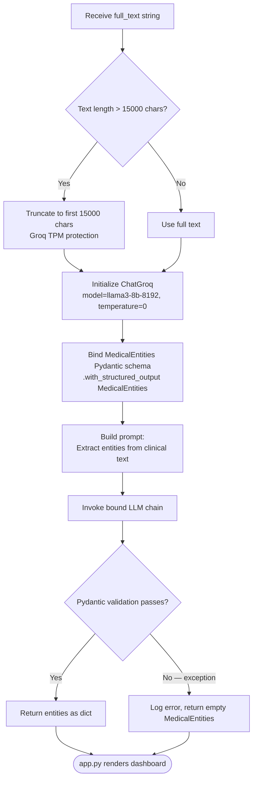

**Complete Implementation:**

```python
# extractor.py

import os
from dotenv import load_dotenv
from langchain_groq import ChatGroq
from pydantic import BaseModel, Field

load_dotenv()

GROQ_MODEL = "llama3-8b-8192"
GROQ_TEMPERATURE = 0
MAX_CHARS = 15000


class MedicalEntities(BaseModel):
    """Pydantic schema for structured medical entity extraction."""
    diagnoses: list[str] = Field(
        description="List of identified diseases, disorders, or medical conditions"
    )
    medications: list[str] = Field(
        description="List of medications including name, dosage, and frequency if present"
    )
    allergies: list[str] = Field(
        description="Patient allergies and documented adverse reactions"
    )
    critical_risks: list[str] = Field(
        description="High-priority alerts, red flags, abnormal lab values, or risk factors"
    )


def extract_medical_data(text: str) -> dict:
    """
    Extracts structured medical entities from clinical text using Groq + Pydantic.

    Args:
        text (str): Raw text extracted from the medical PDF

    Returns:
        dict: Keys — diagnoses, medications, allergies, critical_risks (all lists of str)
    """
    try:
        # Protect against Groq free-tier TPM limits on large documents
        safe_text = text[:MAX_CHARS] if len(text) > MAX_CHARS else text

        llm = ChatGroq(
            model=GROQ_MODEL,
            temperature=GROQ_TEMPERATURE,
            api_key=os.getenv("GROQ_API_KEY")
        )

        # Bind the Pydantic schema — forces structured JSON output
        structured_llm = llm.with_structured_output(MedicalEntities)

        prompt = (
            "You are a medical data extraction expert. "
            "Extract the following medical entities from the clinical text below. "
            "If a category has no entries, return an empty list. "
            "Do not guess or invent information not present in the text.\n\n"
            f"Clinical Text:\n{safe_text}"
        )

        result = structured_llm.invoke(prompt)
        return result.dict()

    except Exception as e:
        print(f"[extractor.py] Extraction error: {e}")
        # Return a safe empty result so the UI does not crash
        return MedicalEntities(
            diagnoses=[],
            medications=[],
            allergies=[],
            critical_risks=[]
        ).dict()
```

---

### 8.3 `rag_engine.py`

**Purpose:** This is the core of the Q&A system. It takes the document chunks, embeds them using Voyage AI, stores them in a local FAISS index, and constructs a history-aware conversational retrieval chain that allows users to ask follow-up questions that reference earlier answers.

**Two Key Functions:**

```
build_vectorstore(chunks)         → Embeds chunks via Voyage AI, stores in FAISS
create_conversation_chain(vs)     → Builds the full RAG chain with chat history support
```

**Vectorstore Build Flow:**

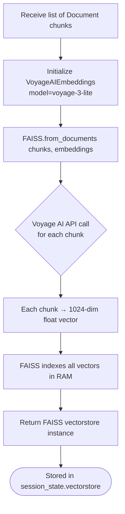

**Conversation Chain Architecture:**

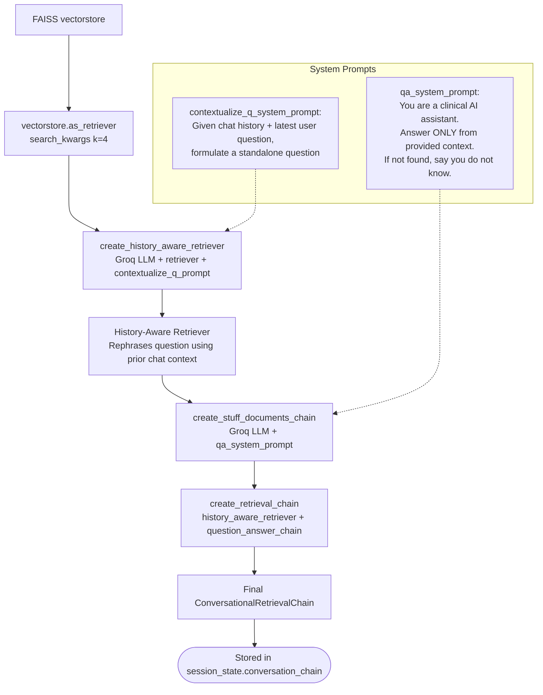

**Complete Implementation:**

```python
# rag_engine.py

import os
from dotenv import load_dotenv
from langchain_groq import ChatGroq
from langchain_voyageai import VoyageAIEmbeddings
from langchain_community.vectorstores import FAISS
from langchain.chains import create_retrieval_chain
from langchain.chains.combine_documents import create_stuff_documents_chain
from langchain.chains import create_history_aware_retriever
from langchain_core.prompts import ChatPromptTemplate, MessagesPlaceholder
from langchain_core.messages import HumanMessage, AIMessage

load_dotenv()

GROQ_MODEL = "llama3-8b-8192"
VOYAGE_MODEL = "voyage-3-lite"
RETRIEVAL_K = 4


def build_vectorstore(chunks: list) -> FAISS:
    """
    Embeds document chunks using Voyage AI and stores them in a local FAISS index.

    Args:
        chunks (list): List of LangChain Document objects from document_parser.py

    Returns:
        FAISS: An in-memory FAISS vectorstore instance
    """
    embeddings = VoyageAIEmbeddings(
        voyage_api_key=os.getenv("VOYAGE_API_KEY"),
        model=VOYAGE_MODEL
    )
    vectorstore = FAISS.from_documents(chunks, embeddings)
    return vectorstore


def create_conversation_chain(vectorstore: FAISS):
    """
    Builds a history-aware conversational RAG chain over the FAISS vectorstore.

    Args:
        vectorstore (FAISS): The FAISS index built from the document

    Returns:
        A LangChain retrieval chain supporting multi-turn conversation
    """
    llm = ChatGroq(
        model=GROQ_MODEL,
        temperature=0.1,
        api_key=os.getenv("GROQ_API_KEY")
    )

    retriever = vectorstore.as_retriever(
        search_kwargs={"k": RETRIEVAL_K}
    )

    # --- Prompt 1: Rephraser ---
    # Converts a follow-up question into a standalone question using chat history
    contextualize_q_system_prompt = (
        "Given a chat history and the latest user question which might reference "
        "context from the chat history, formulate a standalone question which can "
        "be understood without the chat history. Do NOT answer the question — just "
        "reformulate it if needed, or return it as-is."
    )

    contextualize_q_prompt = ChatPromptTemplate.from_messages([
        ("system", contextualize_q_system_prompt),
        MessagesPlaceholder("chat_history"),
        ("human", "{input}"),
    ])

    history_aware_retriever = create_history_aware_retriever(
        llm, retriever, contextualize_q_prompt
    )

    # --- Prompt 2: Q&A ---
    # Instructs the LLM to answer ONLY from the retrieved context
    qa_system_prompt = (
        "You are a clinical AI assistant helping analyze medical documents. "
        "Answer the user's question based ONLY on the provided context below. "
        "If the answer is not explicitly present in the context, respond with: "
        "'I could not find this information in the uploaded document.' "
        "Never guess, invent, or hallucinate medical information. "
        "Be precise and concise.\n\n"
        "Context:\n{context}"
    )

    qa_prompt = ChatPromptTemplate.from_messages([
        ("system", qa_system_prompt),
        MessagesPlaceholder("chat_history"),
        ("human", "{input}"),
    ])

    question_answer_chain = create_stuff_documents_chain(llm, qa_prompt)

    rag_chain = create_retrieval_chain(
        history_aware_retriever,
        question_answer_chain
    )

    return rag_chain


def format_chat_history(streamlit_messages: list) -> list:
    """
    Converts Streamlit chat history (list of dicts) to LangChain message objects.

    Streamlit format: [{"role": "user", "content": "..."}, {"role": "assistant", ...}]
    LangChain format: [HumanMessage(...), AIMessage(...)]

    Args:
        streamlit_messages (list): Chat history from st.session_state

    Returns:
        list: LangChain-compatible message objects
    """
    langchain_history = []
    for msg in streamlit_messages:
        if msg["role"] == "user":
            langchain_history.append(HumanMessage(content=msg["content"]))
        elif msg["role"] == "assistant":
            langchain_history.append(AIMessage(content=msg["content"]))
    return langchain_history
```

---

### 8.4 `app.py`

**Purpose:** The application hub. Manages the Streamlit UI (sidebar, dashboard, chat), orchestrates all calls between modules, and critically, maintains session state so the application does not re-process the PDF on every single user interaction (Streamlit's biggest gotcha).

**Session State — Why It's Critical:**

Streamlit reruns the **entire Python script** from top to bottom every time a user clicks a button, types in a chat box, or any widget changes. Without session state, the app would re-embed the document every time the user types a character. Session state acts as persistent memory across reruns.

**Session State Variables:**

```
┌───────────────────────────────┬─────────────────────────────────────────────────────┐
│  Variable                     │  Purpose                                            │
├───────────────────────────────┼─────────────────────────────────────────────────────┤
│  st.session_state.processed   │  Bool flag — True once PDF has been processed       │
│  st.session_state.medical_data│  Dict — MedicalEntities JSON from extractor.py      │
│  st.session_state.vectorstore │  FAISS instance — holds all document embeddings     │
│  st.session_state.chain       │  ConversationalRetrievalChain from rag_engine.py    │
│  st.session_state.chat_history│  List of {"role", "content"} dicts for chat display │
└───────────────────────────────┴─────────────────────────────────────────────────────┘
```

**UI Layout Flow:**

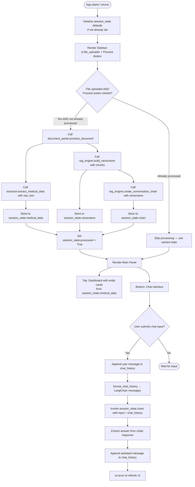

**Complete Implementation:**

```python
# app.py

import streamlit as st
from document_parser import process_document
from extractor import extract_medical_data
from rag_engine import build_vectorstore, create_conversation_chain, format_chat_history

# ─── Page Configuration ────────────────────────────────────────────────────────
st.set_page_config(
    page_title="Medical AI Assistant",
    page_icon="🩺",
    layout="wide"
)

# ─── Session State Initialization ──────────────────────────────────────────────
# Must run on every script execution to ensure keys exist before access
if "processed" not in st.session_state:
    st.session_state.processed = False
if "medical_data" not in st.session_state:
    st.session_state.medical_data = None
if "vectorstore" not in st.session_state:
    st.session_state.vectorstore = None
if "chain" not in st.session_state:
    st.session_state.chain = None
if "chat_history" not in st.session_state:
    st.session_state.chat_history = []

# ─── Sidebar — File Upload & Processing ────────────────────────────────────────
with st.sidebar:
    st.title("🩺 Medical AI Assistant")
    st.markdown("---")
    st.subheader("Upload Document")

    uploaded_file = st.file_uploader(
        label="Upload a medical PDF",
        type=["pdf"],
        help="Supports clinical notes, discharge summaries, lab reports, prescriptions"
    )

    process_btn = st.button("⚙️ Process Document", use_container_width=True)

    if uploaded_file and process_btn and not st.session_state.processed:
        with st.spinner("Parsing document..."):
            raw_text, chunks = process_document(uploaded_file)

        with st.spinner("Extracting medical entities..."):
            st.session_state.medical_data = extract_medical_data(raw_text)

        with st.spinner("Building semantic index (Voyage AI + FAISS)..."):
            st.session_state.vectorstore = build_vectorstore(chunks)
            st.session_state.chain = create_conversation_chain(
                st.session_state.vectorstore
            )

        st.session_state.processed = True
        st.success("✅ Document processed successfully!")

    elif st.session_state.processed:
        st.info("📄 Document already loaded. Upload a new file to switch.")

    if st.session_state.processed:
        st.markdown("---")
        if st.button("🔄 Reset / New Document", use_container_width=True):
            for key in ["processed", "medical_data", "vectorstore", "chain", "chat_history"]:
                del st.session_state[key]
            st.rerun()

# ─── Main Panel ────────────────────────────────────────────────────────────────
st.title("🩺 Medical Document Intelligence")

if not st.session_state.processed:
    st.info("👈 Upload a medical PDF in the sidebar and click **Process Document** to begin.")
    st.stop()

# ─── Dashboard — Extracted Entities ────────────────────────────────────────────
st.subheader("📊 Extracted Medical Entities")

data = st.session_state.medical_data
col1, col2, col3, col4 = st.columns(4)

with col1:
    st.markdown("### 🔴 Critical Risks")
    if data.get("critical_risks"):
        for risk in data["critical_risks"]:
            st.error(risk)
    else:
        st.success("None identified")

with col2:
    st.markdown("### 🔵 Diagnoses")
    if data.get("diagnoses"):
        for dx in data["diagnoses"]:
            st.info(dx)
    else:
        st.write("None identified")

with col3:
    st.markdown("### 💊 Medications")
    if data.get("medications"):
        for med in data["medications"]:
            st.warning(med)
    else:
        st.write("None identified")

with col4:
    st.markdown("### ⚠️ Allergies")
    if data.get("allergies"):
        for allergy in data["allergies"]:
            st.warning(allergy)
    else:
        st.success("None documented")

st.markdown("---")

# ─── Chat Interface ─────────────────────────────────────────────────────────────
st.subheader("💬 Ask About This Patient Record")

# Render existing chat history
for message in st.session_state.chat_history:
    with st.chat_message(message["role"]):
        st.markdown(message["content"])

# Handle new user input
if user_input := st.chat_input("Ask a clinical question about this document..."):

    # Display and store user message
    with st.chat_message("user"):
        st.markdown(user_input)
    st.session_state.chat_history.append({"role": "user", "content": user_input})

    # Convert chat history format for LangChain
    lc_history = format_chat_history(st.session_state.chat_history[:-1])  # exclude current

    # Invoke RAG chain
    with st.chat_message("assistant"):
        with st.spinner("Searching document..."):
            response = st.session_state.chain.invoke({
                "input": user_input,
                "chat_history": lc_history
            })
            answer = response.get("answer", "I was unable to generate a response.")
        st.markdown(answer)

    # Store assistant response
    st.session_state.chat_history.append({"role": "assistant", "content": answer})
```

---

## 9. RAG Pipeline — Deep Dive

### What RAG Is and Why We Use It

Retrieval-Augmented Generation (RAG) solves a fundamental LLM limitation: the model has no knowledge of your specific documents. Without RAG, you'd need to paste the entire document into every prompt — impossible for long clinical records.

RAG splits the problem:
1. **Retrieval:** Find the most relevant portions of the document for the user's question
2. **Augmentation:** Inject those portions into the prompt as context
3. **Generation:** Let the LLM reason over the injected context to produce an answer

The LLM never "sees" the full document — only the relevant 4 chunks (≈4000 characters) that FAISS retrieved.

### Chunking Strategy

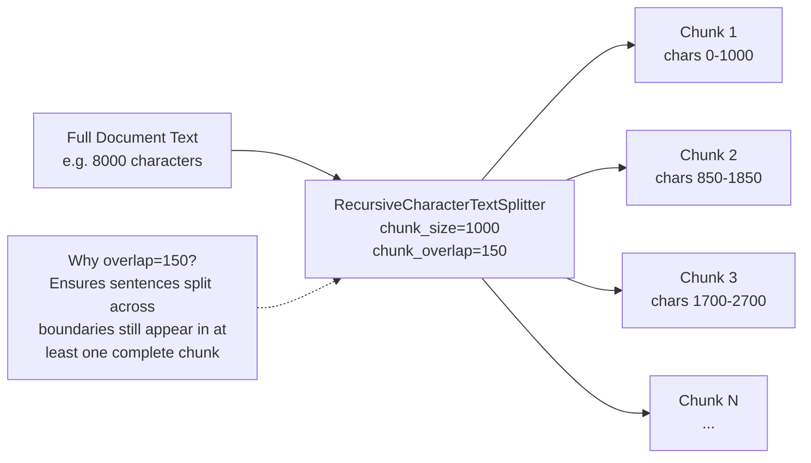

### Similarity Search

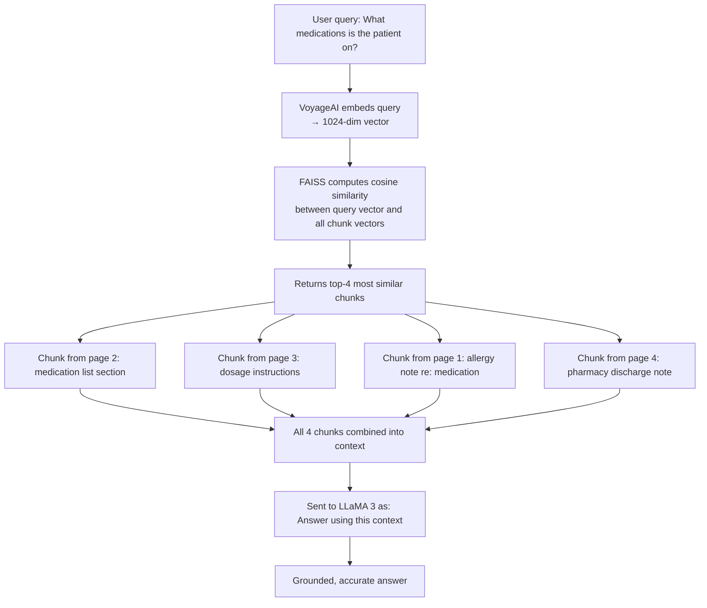

### History-Aware Retrieval

This is what enables multi-turn conversation. Without it, a follow-up question like *"What are its side effects?"* would fail because FAISS doesn't know what "it" refers to.

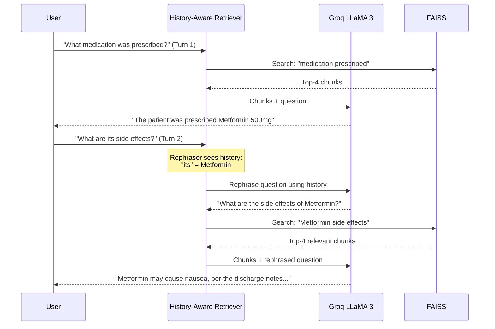

---

## 10. Embedding Strategy — Voyage AI

### Why Voyage AI Over Generic Embeddings

Generic embedding models (e.g., `text-embedding-ada-002`, `all-MiniLM`) are trained on general web text. Medical documents use specialized vocabulary: drug names, ICD codes, clinical abbreviations, procedure names. Voyage AI's `voyage-3-lite` is specifically optimized for retrieval accuracy on domain-specific text.

```
┌────────────────────────────┬──────────────────────────────────────────────────┐
│  Model                     │  Suitability for Medical RAG                     │
├────────────────────────────┼──────────────────────────────────────────────────┤
│  voyage-3-lite (chosen)    │  High — retrieval-optimized, free tier generous  │
│  text-embedding-ada-002    │  Medium — general purpose, costs money           │
│  all-MiniLM-L6-v2          │  Low — good for general, weaker on medical text  │
│  BioBERT embeddings        │  High — but local, no GPU = very slow            │
└────────────────────────────┴──────────────────────────────────────────────────┘
```

### Embedding Dimensions

`voyage-3-lite` produces 512-dimensional vectors. Each chunk becomes a point in 512-dimensional space. Semantic similarity is computed as cosine similarity between these points.

### Free Tier Limits

Voyage AI's free tier provides **50 million tokens/month**. A 10-page medical PDF contains roughly 3,000–5,000 tokens after chunking. You can process approximately **10,000 documents per month** on the free tier.

---

## 11. LLM Strategy — Groq + LLaMA 3

### Why Groq

Groq uses custom Language Processing Units (LPUs) that deliver inference speeds of 500–800 tokens/second — roughly 10–25× faster than standard GPU inference. For local development, this means near-instant responses even on large prompts.

### Model Selection

```
Model: llama3-8b-8192
Context window: 8,192 tokens
Speed: ~750 tokens/second on Groq
Free tier: ~14,400 requests/day, 30 req/min
Temperature for extraction: 0 (deterministic)
Temperature for Q&A: 0.1 (minimal creativity, mostly grounded)
```

### Why Temperature = 0 for Extraction

Entity extraction must be **deterministic and consistent**. If you run the same document through the extractor twice, you should get the same medications listed. Temperature = 0 disables random sampling and forces the model to pick the highest-probability token at every step.

### Why Temperature = 0.1 for Q&A

Pure Q&A benefits from slight variation to sound natural rather than robotic, but must remain primarily grounded. 0.1 allows minimal linguistic variation while keeping the model firmly anchored to the retrieved context.

---

## 12. Vector Store — FAISS

### What FAISS Is

FAISS (Facebook AI Similarity Search) is an open-source library for efficient similarity search over dense vectors. It runs **entirely in RAM** on your local machine with no external service, no API call, and no cost.

### FAISS in This Project

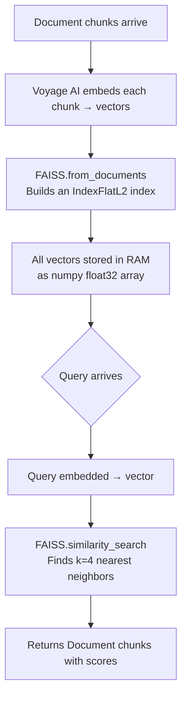

### FAISS Index Types

This project uses the default `IndexFlatL2` — exact brute-force search. For development-scale document sets (hundreds of documents), this is optimal. The index is rebuilt from scratch each time a new document is processed.

### RAM Usage Estimate

| Documents | Approx Chunks | FAISS RAM Usage |
|---|---|---|
| 1 × 10-page PDF | ~80 chunks | < 1 MB |
| 10 × 10-page PDFs | ~800 chunks | ~10 MB |
| 100 × 10-page PDFs | ~8,000 chunks | ~100 MB |

Well within comfortable limits for any modern machine.

---

## 13. Validation & Confidence Layer

### Current Validation Strategy

Since this system is for development and not clinical production, validation is implemented through:

**1. Pydantic Schema Enforcement**
The extractor cannot return data that violates the `MedicalEntities` schema. If the LLM produces malformed output, Pydantic raises an exception that is caught and returns safe empty lists — the app never crashes with a raw LLM hallucination.

**2. Grounded Retrieval**
The Q&A system prompt explicitly instructs the LLM: *"Answer ONLY from provided context. If not found, say you do not know."* This prevents the model from drawing on its training data for medical "facts" that may not apply to this specific patient.

**3. Context Fidelity**
The `k=4` retriever ensures answers are based on multiple corroborating document sections rather than a single potentially misleading chunk.

### Confidence Flow

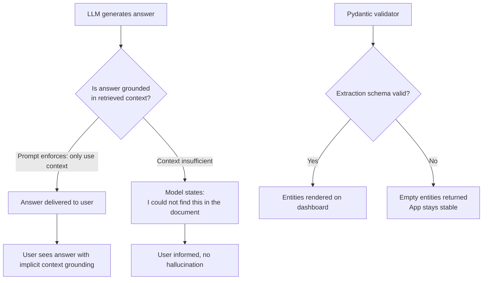

---

## 14. Prompt Engineering

### Extraction Prompt Design

The extraction prompt follows these principles:
- **Role priming:** "You are a medical data extraction expert" — anchors the LLM's behavior
- **Explicit instruction:** Lists exactly what to extract
- **Negative instruction:** "Do not guess or invent" — reduces hallucination
- **Graceful null:** "If none found, return empty lists" — prevents forced invention

```python
prompt = (
    "You are a medical data extraction expert. "
    "Extract the following medical entities from the clinical text below. "
    "If a category has no entries, return an empty list. "
    "Do not guess or invent information not present in the text.\n\n"
    f"Clinical Text:\n{safe_text}"
)
```

### Q&A System Prompt Design

```python
qa_system_prompt = (
    "You are a clinical AI assistant helping analyze medical documents. "
    "Answer the user's question based ONLY on the provided context below. "
    "If the answer is not explicitly present in the context, respond with: "
    "'I could not find this information in the uploaded document.' "
    "Never guess, invent, or hallucinate medical information. "
    "Be precise and concise.\n\n"
    "Context:\n{context}"
)
```

### History Rephrasing Prompt Design

```python
contextualize_q_system_prompt = (
    "Given a chat history and the latest user question which might reference "
    "context from the chat history, formulate a standalone question which can "
    "be understood without the chat history. Do NOT answer the question — just "
    "reformulate it if needed, or return it as-is."
)
```

---

## 15. State Management in Streamlit

### The Problem

Streamlit reruns the entire `app.py` script from line 1 on every user interaction. Without session state, building the FAISS index (which requires Voyage AI API calls) would happen on every keypress in the chat input — making the app unusably slow and burning through API rate limits.

### The Solution — Session State Guard Pattern

```python
# This pattern is the core guard — check before processing
if uploaded_file and process_btn and not st.session_state.processed:
    # Expensive operations happen ONCE
    raw_text, chunks = process_document(uploaded_file)
    st.session_state.medical_data = extract_medical_data(raw_text)
    st.session_state.vectorstore = build_vectorstore(chunks)
    st.session_state.chain = create_conversation_chain(st.session_state.vectorstore)
    st.session_state.processed = True
    
# On ALL subsequent reruns: the `if` block is skipped
# All data is read from session_state — no API calls made
```

### State Lifecycle

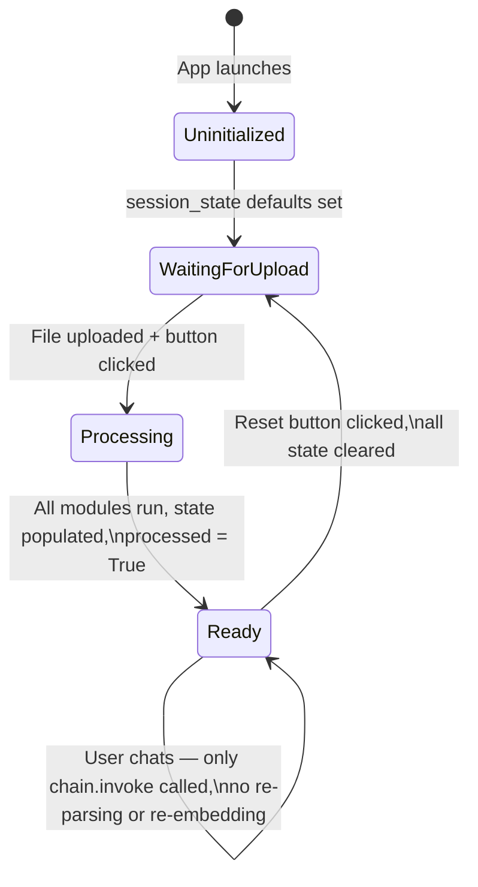

---

## 16. Complete Code Reference

### `requirements.txt`

```text
streamlit
langchain
langchain-groq
langchain-voyageai
langchain-community
langchain-core
faiss-cpu
pymupdf
pydantic
python-dotenv
```

### `.env` (template — do not commit)

```env
GROQ_API_KEY=gsk_your_key_here
VOYAGE_API_KEY=pa_your_key_here
```

### `.gitignore`

```gitignore
venv/
.venv/
.env
__pycache__/
*.pyc
*.pyo
.DS_Store
*.faiss
*.pkl
sample_data/
.antigravity_cache/
```

### `pyproject.toml`

```toml
[project]
name = "medical-ai-assistant"
version = "1.0.0"
description = "Medical Document AI Assistant — RAG-powered clinical document intelligence"
readme = "README.md"
requires-python = ">=3.11"
dependencies = [
    "streamlit",
    "langchain",
    "langchain-groq",
    "langchain-voyageai",
    "langchain-community",
    "langchain-core",
    "faiss-cpu",
    "pymupdf",
    "pydantic",
    "python-dotenv"
]
```

---

## 17. Testing Protocol

### Test Dataset — Where to Get Free Medical PDFs

1. Go to [https://mtsamples.com](https://mtsamples.com)
2. Download at least two document types:
   - One **Discharge Summary** (tests NER breadth — medications, diagnoses, procedures)
   - One **Cardiovascular Consult** (tests clinical Q&A depth)
3. Save them as PDFs in `sample_data/`

### Manual Test Checklist

Run through these tests sequentially after setup:

```
PHASE 1 — Document Processing
  [ ] App launches with no errors: streamlit run app.py
  [ ] File uploader accepts the sample PDF
  [ ] "Process Document" button triggers processing spinners
  [ ] Dashboard populates with at least one entity in at least one category
  [ ] No crash or exception in terminal

PHASE 2 — Entity Extraction (extractor.py)
  [ ] Diagnoses column shows medical conditions from the PDF
  [ ] Medications column shows drugs mentioned in the document
  [ ] Empty categories show "None identified" — not a crash
  [ ] Re-clicking "Process Document" does not re-run (session_state guard works)

PHASE 3 — Semantic Q&A (rag_engine.py + Voyage AI + FAISS)
  [ ] Ask: "What medications is the patient taking?"
        Expected: Specific drug names from the document
  [ ] Ask: "What is the primary diagnosis?"
        Expected: Condition name from the document
  [ ] Ask: "What was the patient's blood pressure?"
        Expected: Specific value from the document OR "I could not find..."
  [ ] Ask about something NOT in the document (e.g. "What is the patient's shoe size?")
        Expected: "I could not find this information in the uploaded document."

PHASE 4 — Conversational Memory
  [ ] Ask: "What medication was prescribed for hypertension?"
        Expected: Drug name
  [ ] Follow up: "What is the dosage?"
        Expected: Dosage of the SAME drug — demonstrates history-aware retrieval
  [ ] Follow up: "Are there any contraindications mentioned?"
        Expected: Relevant information without user repeating the drug name

PHASE 5 — Reset
  [ ] Click "Reset / New Document"
        Expected: Chat clears, dashboard clears, ready to upload new PDF
  [ ] Upload a DIFFERENT PDF
        Expected: New entities extracted, old FAISS index discarded
```

### Terminal Health Check Commands

```bash
# Verify all dependencies installed
pip list | grep -E "streamlit|langchain|faiss|pymupdf|voyage|groq|pydantic"

# Test API keys are loadable
python -c "from dotenv import load_dotenv; import os; load_dotenv(); print('GROQ:', bool(os.getenv('GROQ_API_KEY'))); print('VOYAGE:', bool(os.getenv('VOYAGE_API_KEY')))"

# Run the app
streamlit run app.py
```

---

## 18. Known Gotchas & Fixes

### Gotcha 1 — Streamlit UploadedFile vs. PyMuPDFLoader

**The Problem:** Streamlit's `st.file_uploader` returns an in-memory byte stream. PyMuPDFLoader needs a physical file path string like `"C:/tmp/doc.pdf"`. Passing the Streamlit object directly causes a crash.

**The Fix:** Write the bytes to `tempfile.NamedTemporaryFile`, pass the `.name` (disk path) to PyMuPDFLoader, then delete the temp file in a `finally` block.

```python
with tempfile.NamedTemporaryFile(delete=False, suffix=".pdf") as tmp:
    tmp.write(uploaded_file.read())
    temp_path = tmp.name
# temp_path is now a real disk path
loader = PyMuPDFLoader(temp_path)
```

---

### Gotcha 2 — Streamlit Chat History vs. LangChain Message Types

**The Problem:** Streamlit stores history as dicts: `{"role": "user", "content": "..."}`. LangChain's history-aware retriever expects `HumanMessage` and `AIMessage` objects. Passing dicts causes a `TypeError`.

**The Fix:** Use the `format_chat_history()` function in `rag_engine.py` to translate before every chain invocation.

```python
from langchain_core.messages import HumanMessage, AIMessage

def format_chat_history(streamlit_messages: list) -> list:
    result = []
    for msg in streamlit_messages:
        if msg["role"] == "user":
            result.append(HumanMessage(content=msg["content"]))
        elif msg["role"] == "assistant":
            result.append(AIMessage(content=msg["content"]))
    return result
```

---

### Gotcha 3 — Groq Free Tier Token-Per-Minute (TPM) Limit

**The Problem:** If a user uploads a 40-page PDF, sending the full 30,000-character text to Groq for entity extraction hits the TPM limit, resulting in a `429 RateLimitError`.

**The Fix:** Truncate input to the extractor to `MAX_CHARS = 15000`. This does NOT affect RAG quality — FAISS receives and searches all chunks regardless of extraction truncation.

```python
safe_text = text[:15000] if len(text) > 15000 else text
```

---

### Gotcha 4 — FAISS Rebuild on Every Rerun

**The Problem:** If session state is not guarded correctly, `build_vectorstore()` is called on every Streamlit rerun — triggering Voyage AI API calls each time and rebuilding the entire FAISS index.

**The Fix:** Always guard the processing block with `not st.session_state.processed`.

```python
if uploaded_file and process_btn and not st.session_state.processed:
    # Only runs ONCE
```

---

### Gotcha 5 — Import Errors on First Run

**The Problem:** `langchain-voyageai` or `langchain-community` may not install the LangChain integration correctly if there's a version conflict.

**The Fix:** Install in this specific order:

```bash
pip install --upgrade pip
pip install langchain langchain-core
pip install langchain-groq langchain-voyageai langchain-community
pip install faiss-cpu pymupdf streamlit pydantic python-dotenv
```

---

### Gotcha 6 — Antigravity Agent Context Window

**The Problem:** If you ask an Antigravity agent to "build the whole app," it may hallucinate imports or mix up module boundaries without sufficient context.

**The Fix:** Always open the relevant documentation file in the Antigravity context pane before running a prompt. Use the module-by-module prompts in Section 19, not a single mega-prompt.

---

## 19. AI Agent Prompts for Antigravity

Use these prompts sequentially in Antigravity (or Cursor). Open this documentation file (`MEDICAL_AI_ASSISTANT_FINAL_DOCUMENTATION.md`) in the Antigravity context pane before running each prompt.

### Prompt 1 — Project Setup

```
Read the open documentation file. Set up the project exactly as specified:
1. Create the directory structure from Section 6
2. Create requirements.txt with the exact contents from Section 16
3. Create .env with the template from Section 16
4. Create .gitignore from Section 16
5. Create pyproject.toml from Section 16
6. Create an empty sample_data/ directory
Do not create any Python source files yet.
```

### Prompt 2 — document_parser.py

```
Read the open documentation file, specifically Section 8.1.
Write the complete document_parser.py file exactly as specified.
Requirements:
- Use PyMuPDFLoader from langchain_community
- Handle the Streamlit UploadedFile temp file workaround from Gotcha 1 (Section 18)
- Use RecursiveCharacterTextSplitter with chunk_size=1000 and chunk_overlap=150
- Always clean up the temp file in a finally block
- Return a tuple of (full_text: str, chunks: list)
- Include proper error handling
```

### Prompt 3 — extractor.py

```
Read the open documentation file, specifically Section 8.2.
Write the complete extractor.py file exactly as specified.
Requirements:
- Define the MedicalEntities Pydantic BaseModel with all 4 fields
- Initialize ChatGroq with model="llama3-8b-8192" and temperature=0
- Use .with_structured_output(MedicalEntities) for schema binding
- Truncate input text to 15000 chars max (Gotcha 3 in Section 18)
- Load GROQ_API_KEY from .env using python-dotenv
- Return a dict (not a Pydantic object) from extract_medical_data
- Return an empty MedicalEntities dict on any exception — never raise to app.py
```

### Prompt 4 — rag_engine.py

```
Read the open documentation file, specifically Section 8.3.
Write the complete rag_engine.py file exactly as specified.
Requirements:
- build_vectorstore: Use VoyageAIEmbeddings with model="voyage-3-lite" and FAISS.from_documents
- create_conversation_chain: Use create_history_aware_retriever + create_stuff_documents_chain + create_retrieval_chain
- retriever k=4
- Include both system prompts exactly as specified in Section 14
- Include the format_chat_history function that converts Streamlit dicts to HumanMessage/AIMessage objects (Gotcha 2 in Section 18)
- Load both API keys from .env
```

### Prompt 5 — app.py

```
Read the open documentation file, specifically Section 8.4.
Write the complete app.py file exactly as specified.
Requirements:
- Import from document_parser, extractor, and rag_engine
- Initialize all 5 session_state variables at the top (Section 15)
- Guard the processing block with: if uploaded_file and process_btn and not st.session_state.processed
- Display entity cards using 4 columns: critical_risks (red), diagnoses (blue), medications (warning), allergies (warning)
- Render full chat history before the input box
- Use st.chat_input and append to chat_history after every turn
- Call format_chat_history (excluding the current message) before invoking the chain
- Include a Reset button that clears all session state and calls st.rerun()
```

---

## 20. Limitations & Future Scope

### Current Limitations

```
┌──────────────────────────────────────────────────────────────────────────────┐
│  Limitation                     │  Impact                                   │
├─────────────────────────────────┼───────────────────────────────────────────┤
│  Groq free tier TPM limits      │  Large PDFs (>15k chars) are truncated    │
│                                 │  for extraction — full text still indexed │
├─────────────────────────────────┼───────────────────────────────────────────┤
│  FAISS in-memory only           │  Index lost on app restart — must         │
│                                 │  re-upload PDF to rebuild                 │
├─────────────────────────────────┼───────────────────────────────────────────┤
│  Single document per session    │  Cannot simultaneously query multiple     │
│                                 │  patient records in one session           │
├─────────────────────────────────┼───────────────────────────────────────────┤
│  PDF only                       │  Images, scanned documents, DICOM files   │
│                                 │  not supported in this version            │
├─────────────────────────────────┼───────────────────────────────────────────┤
│  No user authentication         │  Anyone with access to the local URL      │
│                                 │  can view documents                       │
├─────────────────────────────────┼───────────────────────────────────────────┤
│  Not clinically certified       │  System is for development and research   │
│                                 │  only — not for clinical decision-making  │
└─────────────────────────────────┴───────────────────────────────────────────┘
```

### Future Improvements (Out of Scope for This Phase)

The following are documented here for future reference only. Do not implement them in the current development phase.

- **FAISS disk persistence** — Save/load the index so documents don't need re-processing on restart
- **Multi-document sessions** — Build a FAISS index per patient, allow switching between records
- **OCR support** — Integrate PaddleOCR to handle scanned/image-based PDFs
- **BioBERT/ClinicalBERT NER** — Replace LLM-based extraction with fine-tuned medical NER models for higher extraction precision
- **PostgreSQL storage** — Persist extracted entities and chat history across sessions
- **Multi-language support** — Handle non-English medical documents
- **Medical imaging** — DICOM/radiology report support
- **Full MIMIC-IV integration** — Test against the complete clinical dataset for benchmarking

---

## Quick Reference Card

```
┌──────────────────────────────────────────────────────────────────────────────┐
│                      MEDICAL AI ASSISTANT — QUICK REFERENCE                 │
├──────────────────────────────────────────────────────────────────────────────┤
│                                                                              │
│  SETUP COMMANDS                                                              │
│  python -m venv venv                                                         │
│  venv\Scripts\activate          (Windows)                                    │
│  source venv/bin/activate       (Mac/Linux)                                  │
│  pip install -r requirements.txt                                             │
│  streamlit run app.py                                                        │
│                                                                              │
├──────────────────────────────────────────────────────────────────────────────┤
│                                                                              │
│  REQUIRED API KEYS (.env)                                                    │
│  GROQ_API_KEY=gsk_...     → console.groq.com (free)                         │
│  VOYAGE_API_KEY=pa_...    → voyageai.com (free)                             │
│                                                                              │
├──────────────────────────────────────────────────────────────────────────────┤
│                                                                              │
│  MODELS USED                                                                 │
│  LLM:        llama3-8b-8192 via Groq                                        │
│  Embeddings: voyage-3-lite via Voyage AI                                    │
│  VectorDB:   faiss-cpu (local RAM)                                          │
│                                                                              │
├──────────────────────────────────────────────────────────────────────────────┤
│                                                                              │
│  MODULE RESPONSIBILITIES                                                     │
│  document_parser.py  → PDF → raw_text + chunks                              │
│  extractor.py        → raw_text → MedicalEntities JSON                      │
│  rag_engine.py       → chunks → FAISS + ConversationalChain                 │
│  app.py              → UI + session state + orchestration                    │
│                                                                              │
└──────────────────────────────────────────────────────────────────────────────┘
```

---

> **Medical Disclaimer:** This system is a development tool for document analysis and AI research. It is not certified for clinical use. All outputs must be reviewed by qualified healthcare professionals. Never use this system as the sole basis for clinical decisions.

---

*End of Documentation*
