# Medical Document AI Assistant
### Final Implementation Documentation v3 — React + FastAPI Hybrid RAG Edition

> **Frontend:** React + Vite (JSX) + React Router DOM + Axios + Tailwind CSS
> **Backend:** FastAPI (Python) — 13-module architecture
> **Cost:** 100% free — Groq (LLaMA 3 70B) + Voyage AI free tiers
> **Environment:** Local development, compatible with Antigravity / Cursor / VS Code
> **Deployment:** Excluded from this document

---

## Changelog: v2 → v3

```
┌──────────────────────────────────┬──────────────────────────────────────────────┐
│  What Changed                    │  Detail                                      │
├──────────────────────────────────┼──────────────────────────────────────────────┤
│  Embedding model                 │  voyage-3-lite → voyage-large-3              │
├──────────────────────────────────┼──────────────────────────────────────────────┤
│  LLM model                       │  llama3-8b-8192 → llama3-70b-8192            │
├──────────────────────────────────┼──────────────────────────────────────────────┤
│  Backend architecture            │  4 modules → 13 modules (modular split)      │
├──────────────────────────────────┼──────────────────────────────────────────────┤
│  Retrieval strategy              │  FAISS-only → Hybrid FAISS + BM25            │
├──────────────────────────────────┼──────────────────────────────────────────────┤
│  OCR support                     │  Future scope → EasyOCR fallback (active)    │
├──────────────────────────────────┼──────────────────────────────────────────────┤
│  API endpoints                   │  /ask renamed → /chat; /summary, /sources    │
│                                  │  added                                        │
├──────────────────────────────────┼──────────────────────────────────────────────┤
│  New features                    │  Confidence scoring, safety validation,       │
│                                  │  source evidence, multi-key failover,         │
│                                  │  retrieval reranking                          │
├──────────────────────────────────┼──────────────────────────────────────────────┤
│  Frontend                        │  Fetch API → Axios; added React Router DOM,  │
│                                  │  React Context API; 4 full pages              │
├──────────────────────────────────┼──────────────────────────────────────────────┤
│  Chunk parameters                │  size=1000/overlap=150 → size=700/overlap=120 │
├──────────────────────────────────┼──────────────────────────────────────────────┤
│  Retrieval top-k                 │  k=4 → k=5                                   │
├──────────────────────────────────┼──────────────────────────────────────────────┤
│  API key management              │  Single keys → Multi-key rotation failover   │
└──────────────────────────────────┴──────────────────────────────────────────────┘
```

---

## Table of Contents

1. [Project Overview](#1-project-overview)
2. [Final Technology Stack](#2-final-technology-stack)
3. [System Architecture](#3-system-architecture)
4. [Complete Data Flow](#4-complete-data-flow)
5. [Repository Structure](#5-repository-structure)
6. [Backend Setup — FastAPI](#6-backend-setup--fastapi)
7. [Frontend Setup — React + Vite](#7-frontend-setup--react--vite)
8. [API Keys & Configuration](#8-api-keys--configuration)
9. [Backend Module Specifications](#9-backend-module-specifications)
   - 9.1 [pdf_parser.py](#91-pdf_parserpy)
   - 9.2 [ocr.py](#92-ocrpy)
   - 9.3 [chunking.py](#93-chunkingpy)
   - 9.4 [embeddings.py](#94-embeddingspy)
   - 9.5 [vector_store.py](#95-vector_storepy)
   - 9.6 [hybrid_retrieval.py](#96-hybrid_retrievalpy)
   - 9.7 [reranker.py](#97-rerankerpy)
   - 9.8 [rag_pipeline.py](#98-rag_pipelinepy)
   - 9.9 [entities.py](#99-entitiespy)
   - 9.10 [medical_summary.py](#910-medical_summarypy)
   - 9.11 [confidence.py](#911-confidencepy)
   - 9.12 [safety.py](#912-safetypy)
   - 9.13 [prompts.py](#913-promptspy)
   - 9.14 [api_manager.py](#914-api_managerpy)
   - 9.15 [main.py — FastAPI App](#915-mainpy--fastapi-app)
10. [FastAPI Endpoint Reference](#10-fastapi-endpoint-reference)
11. [Frontend Component Architecture](#11-frontend-component-architecture)
12. [Frontend Page Specifications](#12-frontend-page-specifications)
    - 12.1 [Dashboard Page](#121-dashboard-page)
    - 12.2 [Chat Assistant Page](#122-chat-assistant-page)
    - 12.3 [Medical Summary Page](#123-medical-summary-page)
    - 12.4 [Source Evidence Viewer Page](#124-source-evidence-viewer-page)
    - 12.5 [api.js — Axios API Layer](#125-apijs--axios-api-layer)
    - 12.6 [AppContext.jsx — Global State](#126-appcontextjsx--global-state)
13. [Hybrid Retrieval Deep Dive](#13-hybrid-retrieval-deep-dive)
14. [Embedding Strategy — Voyage AI](#14-embedding-strategy--voyage-ai)
15. [LLM Strategy — Groq + LLaMA 3 70B](#15-llm-strategy--groq--llama-3-70b)
16. [Multi-API Key Failover System](#16-multi-api-key-failover-system)
17. [Confidence Scoring System](#17-confidence-scoring-system)
18. [Safety & Hallucination Prevention](#18-safety--hallucination-prevention)
19. [Prompt Engineering](#19-prompt-engineering)
20. [State Management — React Context](#20-state-management--react-context)
21. [CORS & Local Networking](#21-cors--local-networking)
22. [Team Collaboration & GitHub Strategy](#22-team-collaboration--github-strategy)
23. [Testing Protocol](#23-testing-protocol)
24. [Known Gotchas & Fixes](#24-known-gotchas--fixes)
25. [AI Agent Prompts for Antigravity](#25-ai-agent-prompts-for-antigravity)
26. [Limitations & Future Scope](#26-limitations--future-scope)

---

## 1. Project Overview

### What This System Does

The **Medical Document AI Assistant** is a full-stack, locally-run AI platform for medical document intelligence. A clinician or developer uploads a medical PDF through a React web interface. The FastAPI backend parses the document (with optional EasyOCR fallback for scanned PDFs), splits it into chunks, embeds all chunks using Voyage AI's `voyage-large-3` embeddings, builds both a FAISS semantic index and a BM25 keyword index for hybrid retrieval, extracts structured medical entities using Groq's LLaMA 3 70B, and exposes a full suite of endpoints for conversational Q&A, structured summaries, confidence scoring, and source evidence display.

### Why React + FastAPI Instead of Streamlit

```
┌────────────────────────┬────────────────────────────┬──────────────────────────────┐
│  Concern               │  Streamlit                 │  React + FastAPI             │
├────────────────────────┼────────────────────────────┼──────────────────────────────┤
│  UI Customization      │  Very limited              │  Fully custom, any design    │
├────────────────────────┼────────────────────────────┼──────────────────────────────┤
│  Performance           │  Reruns entire script      │  Component-level re-renders  │
├────────────────────────┼────────────────────────────┼──────────────────────────────┤
│  API Reusability       │  None — UI & logic mixed   │  Backend API reusable by any │
│                        │                            │  client (mobile, web, CLI)   │
├────────────────────────┼────────────────────────────┼──────────────────────────────┤
│  Streaming responses   │  Complex workaround        │  Native with SSE / WebSocket │
├────────────────────────┼────────────────────────────┼──────────────────────────────┤
│  Team collaboration    │  Single file bottleneck    │  Clear frontend/backend split│
├────────────────────────┼────────────────────────────┼──────────────────────────────┤
│  Real-world readiness  │  Demo only                 │  Production architecture     │
└────────────────────────┴────────────────────────────┴──────────────────────────────┘
```

---

## 2. Final Technology Stack

```
┌──────────────────────────────────────────────────────────────────────────────┐
│                           COMPLETE TECH STACK v3                             │
├────────────────────────┬─────────────────────────────────────────────────────┤
│  Layer                 │  Tool                                               │
├────────────────────────┼─────────────────────────────────────────────────────┤
│  Frontend Framework    │  React + Vite (JSX)                                 │
│  Frontend Styling      │  Tailwind CSS                                       │
│  Frontend Routing      │  React Router DOM                                   │
│  State Management      │  React Context API                                  │
│  HTTP Client           │  Axios                                              │
│                        │                                                     │
│  Backend Framework     │  FastAPI                                            │
│  Backend Language      │  Python 3.11+                                       │
│  ASGI Server           │  Uvicorn                                            │
│  CORS                  │  FastAPI CORSMiddleware                             │
│  Validation            │  Pydantic v2                                        │
│  Env Management        │  python-dotenv                                      │
│                        │                                                     │
│  Document Parsing      │  PyMuPDF                                            │
│  OCR Fallback          │  EasyOCR (scanned PDFs only)                        │
│  Text Splitting        │  RecursiveCharacterTextSplitter (LangChain)        │
│  Embeddings            │  Voyage AI — voyage-large-3                         │
│  Semantic Search       │  FAISS-CPU (Local, in-RAM)                         │
│  Keyword Search        │  rank-bm25                                          │
│  Reranking             │  Custom semantic + keyword scoring                  │
│  LLM Inference         │  Groq — LLaMA 3 70B 8192 (Free Tier)              │
│  RAG Orchestration     │  LangChain                                          │
│  API Key Failover      │  itertools.cycle + retry logic                      │
└────────────────────────┴─────────────────────────────────────────────────────┘
```

---

## 3. System Architecture

### High-Level Architecture

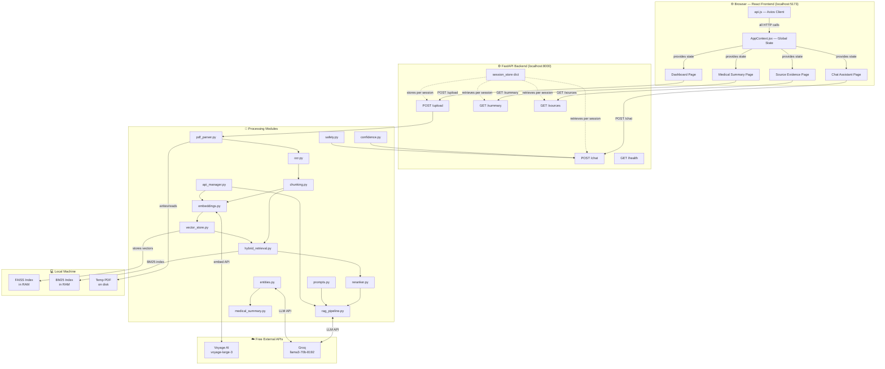

### Request-Response Cycle

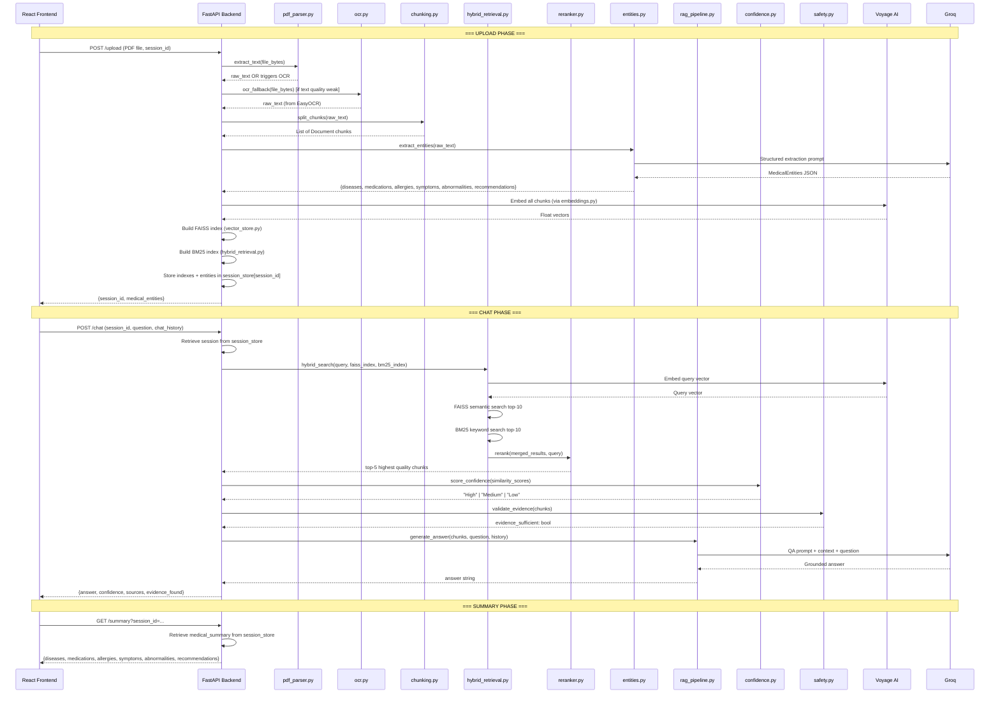

---

## 4. Complete Data Flow

### Upload & Processing Flow

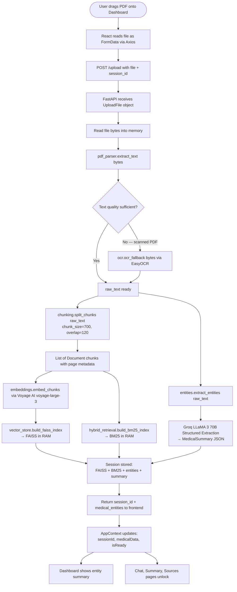

### Chat Query Flow

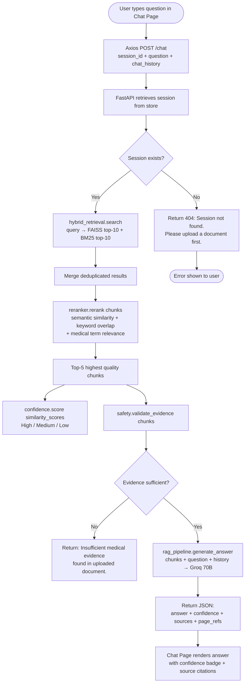

### Hybrid Retrieval Flow

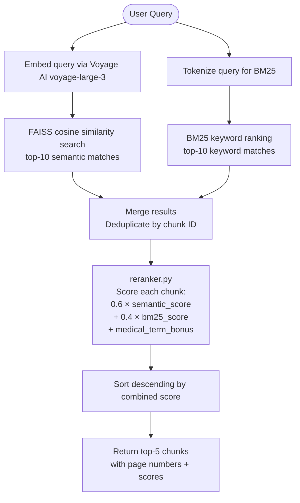

---

## 5. Repository Structure

```
medical-ai-assistant/
│
├── backend/                              ← All Python / FastAPI code
│   ├── main.py                           ← FastAPI app, routes, session store
│   ├── requirements.txt                  ← Python dependencies
│   ├── .env                              ← API keys (NOT committed)
│   ├── .env.example                      ← Safe template to commit
│   ├── .gitignore
│   │
│   └── modules/                          ← All processing logic
│       ├── api_manager.py                ← Multi-key rotation + failover
│       ├── pdf_parser.py                 ← PDF bytes → raw text
│       ├── ocr.py                        ← EasyOCR fallback for scanned PDFs
│       ├── chunking.py                   ← Text → overlapping Document chunks
│       ├── embeddings.py                 ← Voyage AI embedding wrapper
│       ├── vector_store.py               ← FAISS index build + query
│       ├── hybrid_retrieval.py           ← FAISS + BM25 merge
│       ├── reranker.py                   ← Combined score reranking
│       ├── rag_pipeline.py               ← LangChain RAG chain
│       ├── entities.py                   ← Groq structured NER extraction
│       ├── medical_summary.py            ← Pydantic MedicalSummary schema
│       ├── confidence.py                 ← Similarity → confidence label
│       ├── safety.py                     ← Evidence sufficiency validation
│       └── prompts.py                    ← All LLM prompt templates
│
├── frontend/                             ← All React / JSX code
│   ├── src/
│   │   ├── App.jsx                       ← Root component + React Router setup
│   │   ├── main.jsx                      ← Vite entry point
│   │   ├── context/
│   │   │   └── AppContext.jsx            ← Global state via React Context
│   │   ├── services/
│   │   │   └── api.js                    ← All Axios calls to FastAPI
│   │   ├── pages/
│   │   │   ├── Dashboard.jsx             ← PDF upload + entity overview
│   │   │   ├── ChatAssistant.jsx         ← Conversational Q&A
│   │   │   ├── MedicalSummary.jsx        ← Structured summary display
│   │   │   └── SourceEvidence.jsx        ← Retrieved chunk viewer
│   │   ├── components/
│   │   │   ├── Navbar.jsx                ← Navigation between pages
│   │   │   ├── ConfidenceBadge.jsx       ← High/Medium/Low badge
│   │   │   └── SourceCard.jsx            ← Single source chunk display
│   │   └── layouts/
│   │       └── MainLayout.jsx            ← Shared page wrapper
│   ├── index.html
│   ├── package.json
│   ├── vite.config.js
│   └── tailwind.config.js
│
├── sample_data/                          ← Test PDFs (not committed)
│   ├── sample_discharge.pdf
│   └── sample_cardiology.pdf
│
└── README.md
```

### Responsibility Matrix

```
┌──────────────────────────┬──────────────────────────────────────────────────────────┐
│  File                    │  Sole Responsibility                                     │
├──────────────────────────┼──────────────────────────────────────────────────────────┤
│  backend/main.py         │  FastAPI app init, route handlers, session_store dict,   │
│                          │  CORS config, request/response orchestration             │
├──────────────────────────┼──────────────────────────────────────────────────────────┤
│  modules/api_manager.py  │  Load multi-key env vars, rotate via itertools.cycle,    │
│                          │  retry on failure, switch key on 429 rate-limit          │
├──────────────────────────┼──────────────────────────────────────────────────────────┤
│  modules/pdf_parser.py   │  Accept raw bytes, temp file write/delete, PyMuPDF load, │
│                          │  return raw text string                                  │
├──────────────────────────┼──────────────────────────────────────────────────────────┤
│  modules/ocr.py          │  EasyOCR fallback activated only if text quality weak    │
├──────────────────────────┼──────────────────────────────────────────────────────────┤
│  modules/chunking.py     │  RecursiveCharacterTextSplitter, chunk_size=700,         │
│                          │  overlap=120, preserve page metadata                     │
├──────────────────────────┼──────────────────────────────────────────────────────────┤
│  modules/embeddings.py   │  Voyage AI voyage-large-3, batch embed chunks or queries │
├──────────────────────────┼──────────────────────────────────────────────────────────┤
│  modules/vector_store.py │  Build FAISS index from vectors, similarity search       │
├──────────────────────────┼──────────────────────────────────────────────────────────┤
│  modules/hybrid_retrie.. │  Run FAISS + BM25 in parallel, merge deduplicated results│
├──────────────────────────┼──────────────────────────────────────────────────────────┤
│  modules/reranker.py     │  Score merged chunks, return top-5                       │
├──────────────────────────┼──────────────────────────────────────────────────────────┤
│  modules/rag_pipeline.py │  LangChain history-aware RAG chain, format_chat_history  │
├──────────────────────────┼──────────────────────────────────────────────────────────┤
│  modules/entities.py     │  Groq structured NER, returns MedicalSummary dict        │
├──────────────────────────┼──────────────────────────────────────────────────────────┤
│  modules/medical_summar..│  Pydantic MedicalSummary schema definition               │
├──────────────────────────┼──────────────────────────────────────────────────────────┤
│  modules/confidence.py   │  similarity_score → "High" / "Medium" / "Low" label      │
├──────────────────────────┼──────────────────────────────────────────────────────────┤
│  modules/safety.py       │  Validate evidence sufficiency before LLM call           │
├──────────────────────────┼──────────────────────────────────────────────────────────┤
│  modules/prompts.py      │  All system/user prompt template strings                 │
├──────────────────────────┼──────────────────────────────────────────────────────────┤
│  frontend/AppContext.jsx │  Global state: sessionId, medicalData, chatHistory,      │
│                          │  summary, sources — shared across all pages              │
├──────────────────────────┼──────────────────────────────────────────────────────────┤
│  frontend/api.js         │  All Axios calls — upload, chat, getSummary, getSources  │
├──────────────────────────┼──────────────────────────────────────────────────────────┤
│  frontend/Dashboard.jsx  │  PDF drag-drop upload, entity card overview              │
├──────────────────────────┼──────────────────────────────────────────────────────────┤
│  frontend/ChatAssistant  │  Conversational Q&A with confidence badges + citations   │
├──────────────────────────┼──────────────────────────────────────────────────────────┤
│  frontend/MedicalSummary │  Structured summary: diseases, medications, allergies    │
├──────────────────────────┼──────────────────────────────────────────────────────────┤
│  frontend/SourceEvidence │  Retrieved chunk viewer with page numbers                │
└──────────────────────────┴──────────────────────────────────────────────────────────┘
```

---

## 6. Backend Setup — FastAPI

### Step 1 — Create the Backend Virtual Environment

```bash
cd medical-ai-assistant/backend

python -m venv venv

# Activate
# Windows:
venv\Scripts\activate
# Mac/Linux:
source venv/bin/activate
```

### Step 2 — Install Backend Dependencies

Create `backend/requirements.txt`:

```text
fastapi
uvicorn[standard]
python-multipart
langchain
langchain-groq
langchain-voyageai
langchain-community
langchain-core
faiss-cpu
pymupdf
easyocr
rank-bm25
pydantic
voyageai
groq
python-dotenv
```

Install:

```bash
pip install -r requirements.txt
```

### Step 3 — Run the Backend

```bash
uvicorn main:app --reload --host 0.0.0.0 --port 8000
```

Verify: `http://localhost:8000/health` → `{"status": "ok"}`

Auto-generated Swagger docs: `http://localhost:8000/docs`

---

## 7. Frontend Setup — React + Vite

### Step 1 — Scaffold the Project

```bash
cd medical-ai-assistant/frontend
npm create vite@latest . -- --template react
```

### Step 2 — Install Frontend Dependencies

```bash
npm install
npm install axios react-router-dom
npm install -D tailwindcss postcss autoprefixer
npx tailwindcss init -p
```

Update `tailwind.config.js`:

```js
/** @type {import('tailwindcss').Config} */
export default {
  content: ["./index.html", "./src/**/*.{js,jsx}"],
  theme: { extend: {} },
  plugins: [],
}
```

Add to `src/index.css`:

```css
@tailwind base;
@tailwind components;
@tailwind utilities;
```

### Step 3 — Configure Vite Proxy

Create `vite.config.js`:

```js
import { defineConfig } from 'vite'
import react from '@vitejs/plugin-react'

export default defineConfig({
  plugins: [react()],
  server: {
    proxy: {
      '/api': {
        target: 'http://localhost:8000',
        changeOrigin: true,
        rewrite: (path) => path.replace(/^\/api/, '')
      }
    }
  }
})
```

### Step 4 — Run the Frontend

```bash
npm run dev
```

Open `http://localhost:5173`

---

## 8. API Keys & Configuration

### Backend `.env` File

Create `backend/.env`:

```env
# Multiple keys supported — comma-separated, no spaces
GROQ_API_KEYS=gsk_key1_here,gsk_key2_here,gsk_key3_here
VOYAGE_API_KEYS=pa_key1_here,pa_key2_here
```

Create `backend/.env.example` (safe to commit):

```env
GROQ_API_KEYS=gsk_your_groq_key_here
VOYAGE_API_KEYS=pa_your_voyage_key_here
```

Add to `backend/.gitignore`:

```gitignore
venv/
.env
__pycache__/
*.pyc
*.faiss
*.pkl
```

### Getting Free API Keys

**Groq (LLM Inference — Free):**
1. Visit `https://console.groq.com`
2. Sign up — no credit card required
3. API Keys → Create API Key
4. Key starts with `gsk_`
5. Free tier: LLaMA 3 70B supported (lower rate limit than 8B — use multi-key)

**Voyage AI (Embeddings — Free):**
1. Visit `https://www.voyageai.com`
2. Sign up — no credit card required
3. Dashboard → API Keys → Create
4. Key starts with `pa_`
5. Free tier: 50 million tokens/month on `voyage-large-3`

### Model & Parameter Constants

```python
# Define in each module that uses them, or import from a shared config.py

GROQ_MODEL           = "llama3-70b-8192"
VOYAGE_MODEL         = "voyage-large-3"
CHUNK_SIZE           = 700
CHUNK_OVERLAP        = 120
RETRIEVAL_K          = 5
MAX_EXTRACTION_CHARS = 15000      # Protects Groq free-tier TPM limits
GROQ_TEMP_EXTRACT    = 0          # Deterministic NER
GROQ_TEMP_QA         = 0.1        # Slightly natural Q&A
MIN_TEXT_LENGTH      = 100        # Below this triggers OCR fallback
```

---

## 9. Backend Module Specifications

### 9.1 `pdf_parser.py`

**Purpose:** Accepts raw PDF bytes, writes to a temp file, loads with PyMuPDF, returns raw text. Returns the text and a quality flag to signal whether OCR fallback is needed.

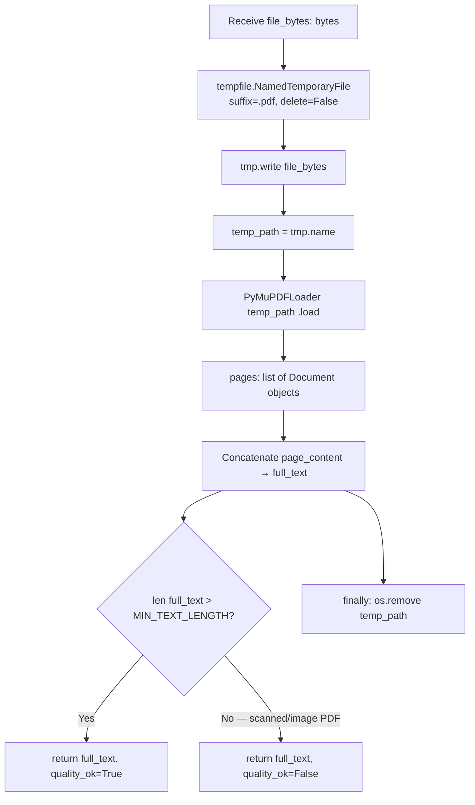

**Implementation:**

```python
# backend/modules/pdf_parser.py

import tempfile
import os
from langchain_community.document_loaders import PyMuPDFLoader

MIN_TEXT_LENGTH = 100


def extract_text(file_bytes: bytes) -> tuple[str, bool]:
    """
    Extracts raw text from PDF bytes using PyMuPDF.

    Returns:
        full_text: Entire document as a concatenated string
        quality_ok: False if text is too short (triggers OCR fallback)
    """
    temp_path = None
    try:
        with tempfile.NamedTemporaryFile(delete=False, suffix=".pdf") as tmp:
            tmp.write(file_bytes)
            temp_path = tmp.name

        loader = PyMuPDFLoader(temp_path)
        documents = loader.load()
        full_text = "\n".join([doc.page_content for doc in documents])

        quality_ok = len(full_text.strip()) >= MIN_TEXT_LENGTH
        return full_text, quality_ok

    except Exception as e:
        raise RuntimeError(f"PDF parsing failed: {str(e)}")

    finally:
        if temp_path and os.path.exists(temp_path):
            os.remove(temp_path)
```

---

### 9.2 `ocr.py`

**Purpose:** EasyOCR fallback. Called only when `pdf_parser` returns `quality_ok=False` (scanned/image PDFs). Renders each PDF page as an image and runs OCR.

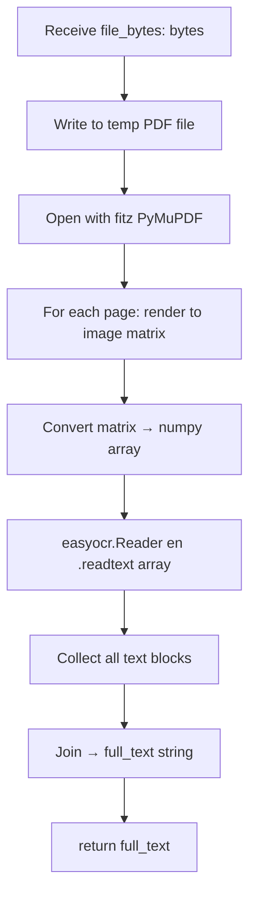

**Implementation:**

```python
# backend/modules/ocr.py

import tempfile
import os
import numpy as np
import easyocr
import fitz  # PyMuPDF

reader = easyocr.Reader(['en'], gpu=False)


def ocr_fallback(file_bytes: bytes) -> str:
    """
    Extracts text from scanned PDFs using EasyOCR.
    Called only when PyMuPDF returns insufficient text.

    Returns:
        full_text: OCR-extracted text string
    """
    temp_path = None
    try:
        with tempfile.NamedTemporaryFile(delete=False, suffix=".pdf") as tmp:
            tmp.write(file_bytes)
            temp_path = tmp.name

        doc = fitz.open(temp_path)
        all_text = []

        for page in doc:
            mat = fitz.Matrix(2, 2)  # 2x zoom for better OCR accuracy
            pix = page.get_pixmap(matrix=mat)
            img_array = np.frombuffer(pix.samples, dtype=np.uint8).reshape(
                pix.height, pix.width, pix.n
            )
            results = reader.readtext(img_array)
            page_text = " ".join([text for _, text, _ in results])
            all_text.append(page_text)

        return "\n".join(all_text)

    except Exception as e:
        raise RuntimeError(f"OCR failed: {str(e)}")

    finally:
        if temp_path and os.path.exists(temp_path):
            os.remove(temp_path)
```

---

### 9.3 `chunking.py`

**Purpose:** Splits raw text into overlapping Document chunks using LangChain's `RecursiveCharacterTextSplitter`. Preserves source page metadata for citations.

**Implementation:**

```python
# backend/modules/chunking.py

from langchain.text_splitter import RecursiveCharacterTextSplitter
from langchain_core.documents import Document

CHUNK_SIZE = 700
CHUNK_OVERLAP = 120


def split_chunks(full_text: str, source: str = "uploaded_document") -> list[Document]:
    """
    Splits full document text into overlapping chunks for embedding.

    Returns:
        List of LangChain Document objects with metadata
    """
    splitter = RecursiveCharacterTextSplitter(
        chunk_size=CHUNK_SIZE,
        chunk_overlap=CHUNK_OVERLAP,
        separators=["\n\n", "\n", ".", " ", ""]
    )

    raw_chunks = splitter.split_text(full_text)

    chunks = [
        Document(
            page_content=chunk,
            metadata={"source": source, "chunk_index": i}
        )
        for i, chunk in enumerate(raw_chunks)
    ]

    return chunks
```

---

### 9.4 `embeddings.py`

**Purpose:** Wraps Voyage AI `voyage-large-3` embedding calls. Uses `api_manager.py` for key rotation. Supports batch embedding for chunks and single-query embedding for retrieval.

**Implementation:**

```python
# backend/modules/embeddings.py

from langchain_voyageai import VoyageAIEmbeddings
from modules.api_manager import APIKeyManager

VOYAGE_MODEL = "voyage-large-3"

voyage_manager = APIKeyManager("VOYAGE_API_KEYS")


def get_embeddings() -> VoyageAIEmbeddings:
    """Returns a Voyage AI embeddings instance using the current active key."""
    return VoyageAIEmbeddings(
        voyage_api_key=voyage_manager.get_key(),
        model=VOYAGE_MODEL
    )


def embed_chunks(chunks: list) -> VoyageAIEmbeddings:
    """Returns embeddings object ready for FAISS indexing."""
    return get_embeddings()
```

---

### 9.5 `vector_store.py`

**Purpose:** Builds a FAISS in-memory vector index from Document chunks + Voyage AI embeddings. Provides similarity search.

**Implementation:**

```python
# backend/modules/vector_store.py

from langchain_community.vectorstores import FAISS
from modules.embeddings import get_embeddings

RETRIEVAL_K = 5


def build_faiss_index(chunks: list) -> FAISS:
    """
    Embeds document chunks and indexes them in FAISS.

    Args:
        chunks: List of LangChain Document objects

    Returns:
        FAISS vectorstore (in-memory)
    """
    embeddings = get_embeddings()
    vectorstore = FAISS.from_documents(chunks, embeddings)
    return vectorstore


def semantic_search(vectorstore: FAISS, query: str, k: int = RETRIEVAL_K) -> list:
    """Returns top-k semantically similar chunks with scores."""
    return vectorstore.similarity_search_with_score(query, k=k * 2)
```

---

### 9.6 `hybrid_retrieval.py`

**Purpose:** Runs FAISS semantic search and BM25 keyword search in parallel, merges results, and passes to reranker.

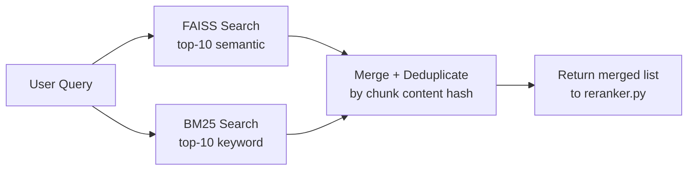

**Implementation:**

```python
# backend/modules/hybrid_retrieval.py

from rank_bm25 import BM25Okapi
from langchain_community.vectorstores import FAISS


def build_bm25_index(chunks: list) -> BM25Okapi:
    """Builds a BM25 index from document chunks."""
    tokenized = [chunk.page_content.lower().split() for chunk in chunks]
    return BM25Okapi(tokenized)


def hybrid_search(
    query: str,
    vectorstore: FAISS,
    bm25_index: BM25Okapi,
    chunks: list,
    k: int = 10
) -> list:
    """
    Combines FAISS semantic search and BM25 keyword search.

    Returns:
        Merged list of (Document, semantic_score, bm25_score) tuples
    """
    # Semantic search
    semantic_results = vectorstore.similarity_search_with_score(query, k=k)

    # BM25 keyword search
    tokenized_query = query.lower().split()
    bm25_scores = bm25_index.get_scores(tokenized_query)
    top_bm25_indices = sorted(
        range(len(bm25_scores)), key=lambda i: bm25_scores[i], reverse=True
    )[:k]

    # Merge and deduplicate
    seen_content = set()
    merged = []

    for doc, sem_score in semantic_results:
        content_hash = hash(doc.page_content[:100])
        if content_hash not in seen_content:
            seen_content.add(content_hash)
            # Find BM25 score for this chunk
            bm25_score = 0.0
            for idx in top_bm25_indices:
                if idx < len(chunks) and chunks[idx].page_content == doc.page_content:
                    bm25_score = float(bm25_scores[idx])
                    break
            merged.append((doc, float(sem_score), bm25_score))

    # Add BM25-only results not already in semantic results
    for idx in top_bm25_indices:
        if idx < len(chunks):
            doc = chunks[idx]
            content_hash = hash(doc.page_content[:100])
            if content_hash not in seen_content:
                seen_content.add(content_hash)
                merged.append((doc, 0.0, float(bm25_scores[idx])))

    return merged
```

---

### 9.7 `reranker.py`

**Purpose:** Scores merged hybrid results using a weighted combination of semantic similarity, BM25 score, and medical terminology relevance. Returns top-5 chunks.

**Implementation:**

```python
# backend/modules/reranker.py

MEDICAL_TERMS = {
    "diagnosis", "medication", "dosage", "allergy", "symptom",
    "prescribed", "treatment", "abnormal", "lab", "glucose",
    "blood", "pressure", "mg", "ml", "patient", "clinical"
}
TOP_K = 5


def rerank(merged_results: list, query: str) -> list:
    """
    Reranks hybrid search results using combined scoring.

    Scoring formula:
        combined = 0.6 * (1 - semantic_score) + 0.4 * normalized_bm25
                   + 0.1 * medical_term_bonus

    Note: FAISS returns L2 distance (lower = better), so we invert.

    Returns:
        Top-5 Document objects with metadata
    """
    if not merged_results:
        return []

    # Normalize BM25 scores to [0, 1]
    bm25_scores = [r[2] for r in merged_results]
    max_bm25 = max(bm25_scores) if max(bm25_scores) > 0 else 1.0

    query_terms = set(query.lower().split())
    scored = []

    for doc, sem_score, bm25_score in merged_results:
        # Semantic: invert L2 distance (lower distance = higher relevance)
        semantic_relevance = 1.0 / (1.0 + sem_score)

        # BM25: normalize
        normalized_bm25 = bm25_score / max_bm25

        # Medical term bonus
        chunk_terms = set(doc.page_content.lower().split())
        medical_overlap = len(chunk_terms & MEDICAL_TERMS & query_terms)
        medical_bonus = min(medical_overlap * 0.05, 0.1)

        combined = (
            0.6 * semantic_relevance
            + 0.4 * normalized_bm25
            + medical_bonus
        )

        scored.append((doc, combined))

    scored.sort(key=lambda x: x[1], reverse=True)
    return [doc for doc, _ in scored[:TOP_K]], [score for _, score in scored[:TOP_K]]
```

---

### 9.8 `rag_pipeline.py`

**Purpose:** Builds a history-aware LangChain RAG chain using the FAISS vectorstore and Groq LLaMA 3 70B. Also provides `format_chat_history` for frontend dict → LangChain message conversion.

**Implementation:**

```python
# backend/modules/rag_pipeline.py

import os
from dotenv import load_dotenv
from langchain_groq import ChatGroq
from langchain_community.vectorstores import FAISS
from langchain.chains import create_retrieval_chain
from langchain.chains.combine_documents import create_stuff_documents_chain
from langchain.chains import create_history_aware_retriever
from langchain_core.prompts import ChatPromptTemplate, MessagesPlaceholder
from langchain_core.messages import HumanMessage, AIMessage
from modules.prompts import CONTEXTUALIZE_PROMPT, QA_SYSTEM_PROMPT
from modules.api_manager import APIKeyManager

load_dotenv()

GROQ_MODEL = "llama3-70b-8192"
groq_manager = APIKeyManager("GROQ_API_KEYS")


def create_rag_chain(vectorstore: FAISS):
    """
    Builds a history-aware conversational RAG chain.

    Returns:
        LangChain retrieval chain supporting multi-turn chat
    """
    llm = ChatGroq(
        model=GROQ_MODEL,
        temperature=0.1,
        api_key=groq_manager.get_key()
    )

    retriever = vectorstore.as_retriever(search_kwargs={"k": 5})

    contextualize_q_prompt = ChatPromptTemplate.from_messages([
        ("system", CONTEXTUALIZE_PROMPT),
        MessagesPlaceholder("chat_history"),
        ("human", "{input}"),
    ])

    history_aware_retriever = create_history_aware_retriever(
        llm, retriever, contextualize_q_prompt
    )

    qa_prompt = ChatPromptTemplate.from_messages([
        ("system", QA_SYSTEM_PROMPT),
        MessagesPlaceholder("chat_history"),
        ("human", "{input}"),
    ])

    question_answer_chain = create_stuff_documents_chain(llm, qa_prompt)
    rag_chain = create_retrieval_chain(history_aware_retriever, question_answer_chain)

    return rag_chain


def generate_answer(chain, question: str, chat_history: list) -> str:
    """Invokes the RAG chain and returns the answer string."""
    lc_history = format_chat_history(chat_history)
    response = chain.invoke({"input": question, "chat_history": lc_history})
    return response.get("answer", "Unable to generate answer.")


def format_chat_history(messages: list[dict]) -> list:
    """
    Converts frontend chat history dicts to LangChain message objects.

    Frontend format:  [{"role": "user", "content": "..."}]
    LangChain format: [HumanMessage(content="..."), AIMessage(content="...")]
    """
    result = []
    for msg in messages:
        if msg.get("role") == "user":
            result.append(HumanMessage(content=msg["content"]))
        elif msg.get("role") == "assistant":
            result.append(AIMessage(content=msg["content"]))
    return result
```

---

### 9.9 `entities.py`

**Purpose:** Sends raw text to Groq LLaMA 3 70B with a Pydantic schema to extract structured medical entities. Uses `api_manager` for key rotation.

**Implementation:**

```python
# backend/modules/entities.py

import os
from dotenv import load_dotenv
from langchain_groq import ChatGroq
from modules.medical_summary import MedicalSummary
from modules.api_manager import APIKeyManager
from modules.prompts import EXTRACTION_PROMPT

load_dotenv()

GROQ_MODEL = "llama3-70b-8192"
MAX_CHARS = 15000

groq_manager = APIKeyManager("GROQ_API_KEYS")


def extract_entities(text: str) -> dict:
    """
    Extracts structured medical entities from clinical text.

    Returns:
        dict with keys: diseases, medications, allergies, symptoms,
                        abnormalities, recommendations
    """
    try:
        safe_text = text[:MAX_CHARS]

        llm = ChatGroq(
            model=GROQ_MODEL,
            temperature=0,
            api_key=groq_manager.get_key()
        )

        structured_llm = llm.with_structured_output(MedicalSummary)
        prompt = f"{EXTRACTION_PROMPT}\n\nClinical Text:\n{safe_text}"
        result = structured_llm.invoke(prompt)
        return result.dict()

    except Exception as e:
        print(f"[entities] Error: {e}")
        return MedicalSummary(
            diseases=[], medications=[], allergies=[],
            symptoms=[], abnormalities=[], recommendations=[]
        ).dict()
```

---

### 9.10 `medical_summary.py`

**Purpose:** Defines the Pydantic schema for structured medical extraction.

**Implementation:**

```python
# backend/modules/medical_summary.py

from pydantic import BaseModel, Field


class MedicalSummary(BaseModel):
    diseases: list[str] = Field(
        description="Identified diseases, disorders, and medical conditions"
    )
    medications: list[str] = Field(
        description="Medications with name, dosage, and frequency where available"
    )
    allergies: list[str] = Field(
        description="Patient allergies and documented adverse reactions"
    )
    symptoms: list[str] = Field(
        description="Reported symptoms and clinical complaints"
    )
    abnormalities: list[str] = Field(
        description="Abnormal lab values, imaging findings, or clinical deviations"
    )
    recommendations: list[str] = Field(
        description="Follow-up actions, referrals, or clinical recommendations"
    )
```

---

### 9.11 `confidence.py`

**Purpose:** Converts retrieval similarity scores into human-readable confidence labels.

**Implementation:**

```python
# backend/modules/confidence.py


def score_confidence(similarity_scores: list[float]) -> str:
    """
    Derives a confidence label from the top retrieval similarity scores.

    FAISS returns L2 distance (lower = better).
    We convert to similarity: sim = 1 / (1 + distance)

    Returns:
        "High" | "Medium" | "Low"
    """
    if not similarity_scores:
        return "Low"

    # Convert L2 distances to similarity scores
    similarities = [1.0 / (1.0 + d) for d in similarity_scores[:3]]
    avg_similarity = sum(similarities) / len(similarities)

    if avg_similarity > 0.80:
        return "High"
    elif avg_similarity > 0.60:
        return "Medium"
    else:
        return "Low"
```

---

### 9.12 `safety.py`

**Purpose:** Validates that retrieved evidence is sufficient before passing to the LLM. Prevents low-quality hallucinations.

**Implementation:**

```python
# backend/modules/safety.py

MIN_CHUNKS_REQUIRED = 1
MIN_CHUNK_LENGTH = 50
INSUFFICIENT_MESSAGE = "Insufficient medical evidence found in uploaded document."


def validate_evidence(chunks: list) -> tuple[bool, str]:
    """
    Validates whether retrieved chunks are sufficient to answer safely.

    Returns:
        (evidence_sufficient: bool, fallback_message: str)
    """
    if not chunks:
        return False, INSUFFICIENT_MESSAGE

    valid_chunks = [
        c for c in chunks
        if len(c.page_content.strip()) >= MIN_CHUNK_LENGTH
    ]

    if len(valid_chunks) < MIN_CHUNKS_REQUIRED:
        return False, INSUFFICIENT_MESSAGE

    return True, ""
```

---

### 9.13 `prompts.py`

**Purpose:** Centralises all LLM prompt templates in one place.

**Implementation:**

```python
# backend/modules/prompts.py

CONTEXTUALIZE_PROMPT = (
    "Given the chat history and the latest user question, "
    "formulate a standalone question that can be understood without the chat history. "
    "Do NOT answer — just reformulate or return as-is."
)

QA_SYSTEM_PROMPT = (
    "You are a highly accurate medical document assistant. "
    "Answer the question based ONLY on the context provided below. "
    "STRICT RULES:\n"
    "1. Use ONLY the provided medical context.\n"
    "2. Do NOT hallucinate or invent information.\n"
    "3. If the answer is not in the context, say: "
    "'Insufficient medical evidence found in uploaded document.'\n"
    "4. Be medically precise.\n"
    "5. Prioritize factual correctness over completeness.\n\n"
    "Context:\n{context}"
)

EXTRACTION_PROMPT = (
    "You are a medical data extraction expert. "
    "Extract all medical entities from the clinical text below. "
    "Return empty lists for categories not present in the text. "
    "Do not invent or guess information not explicitly stated."
)
```

---

### 9.14 `api_manager.py`

**Purpose:** Loads multiple API keys from env vars, rotates them using `itertools.cycle`, retries on failure, and switches keys on 429 rate-limit errors. Prevents crashes due to key exhaustion.

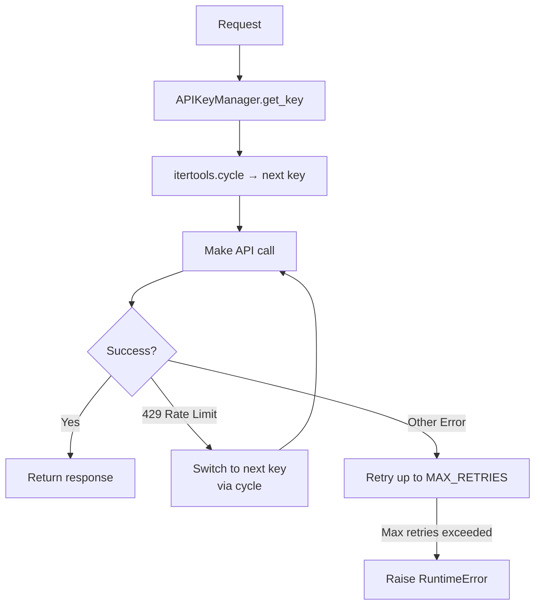

**Implementation:**

```python
# backend/modules/api_manager.py

import os
import itertools
from dotenv import load_dotenv

load_dotenv()

MAX_RETRIES = 3


class APIKeyManager:
    """
    Manages a pool of API keys with automatic rotation and retry logic.

    Usage:
        manager = APIKeyManager("GROQ_API_KEYS")
        key = manager.get_key()
    """

    def __init__(self, env_var: str):
        raw = os.getenv(env_var, "")
        keys = [k.strip() for k in raw.split(",") if k.strip()]

        if not keys:
            raise ValueError(
                f"No API keys found for {env_var}. "
                f"Check your .env file."
            )

        self._keys = keys
        self._cycle = itertools.cycle(keys)
        self._current_key = next(self._cycle)

    def get_key(self) -> str:
        """Returns the current active key."""
        return self._current_key

    def rotate_key(self):
        """Rotates to the next key in the pool."""
        self._current_key = next(self._cycle)
        print(f"[api_manager] Rotated to next API key.")

    def get_key_count(self) -> int:
        return len(self._keys)
```

---

### 9.15 `main.py` — FastAPI App

**Purpose:** Defines the FastAPI application, all route handlers, and session storage. Orchestrates all modules for each request.

**Session Store Design:**

```
session_store: dict = {
    "abc-123": {
        "chain":       <LangChain RAG chain>,
        "vectorstore": <FAISS instance>,
        "bm25_index":  <BM25Okapi instance>,
        "chunks":      <List of Document objects>,
        "entities":    <MedicalSummary dict>,
    }
}
```

**Complete Implementation:**

```python
# backend/main.py

import uuid
from fastapi import FastAPI, UploadFile, File, Form, HTTPException
from fastapi.middleware.cors import CORSMiddleware
from pydantic import BaseModel

from modules.pdf_parser import extract_text
from modules.ocr import ocr_fallback
from modules.chunking import split_chunks
from modules.vector_store import build_faiss_index
from modules.hybrid_retrieval import build_bm25_index, hybrid_search
from modules.reranker import rerank
from modules.rag_pipeline import create_rag_chain, generate_answer, format_chat_history
from modules.entities import extract_entities
from modules.confidence import score_confidence
from modules.safety import validate_evidence

app = FastAPI(
    title="Medical AI Assistant API",
    description="Hybrid RAG medical document intelligence backend",
    version="3.0.0"
)

app.add_middleware(
    CORSMiddleware,
    allow_origins=["http://localhost:5173", "http://localhost:3000"],
    allow_credentials=True,
    allow_methods=["*"],
    allow_headers=["*"],
)

session_store: dict = {}

# ─── Request / Response Models ────────────────────────────────────────────────

class ChatRequest(BaseModel):
    session_id: str
    question: str
    chat_history: list[dict] = []

class ChatResponse(BaseModel):
    answer: str
    confidence: str
    sources: list[dict]
    evidence_found: bool

class UploadResponse(BaseModel):
    session_id: str
    medical_entities: dict

# ─── Routes ───────────────────────────────────────────────────────────────────

@app.get("/health")
def health_check():
    return {"status": "ok"}


@app.post("/upload", response_model=UploadResponse)
async def upload_document(
    file: UploadFile = File(...),
    session_id: str = Form(default=None)
):
    if not file.filename.endswith(".pdf"):
        raise HTTPException(status_code=400, detail="Only PDF files are supported.")

    if not session_id:
        session_id = str(uuid.uuid4())

    file_bytes = await file.read()

    # Text extraction with OCR fallback
    raw_text, quality_ok = extract_text(file_bytes)
    if not quality_ok:
        raw_text = ocr_fallback(file_bytes)

    # Processing pipeline
    chunks = split_chunks(raw_text, source=file.filename)
    entities = extract_entities(raw_text)
    vectorstore = build_faiss_index(chunks)
    bm25_index = build_bm25_index(chunks)
    chain = create_rag_chain(vectorstore)

    session_store[session_id] = {
        "chain": chain,
        "vectorstore": vectorstore,
        "bm25_index": bm25_index,
        "chunks": chunks,
        "entities": entities,
    }

    return UploadResponse(session_id=session_id, medical_entities=entities)


@app.post("/chat", response_model=ChatResponse)
async def chat(request: ChatRequest):
    session = session_store.get(request.session_id)
    if not session:
        raise HTTPException(
            status_code=404,
            detail="Session not found. Please upload a document first."
        )

    # Hybrid retrieval
    merged = hybrid_search(
        request.question,
        session["vectorstore"],
        session["bm25_index"],
        session["chunks"]
    )
    top_chunks, scores = rerank(merged, request.question)

    # Confidence + safety
    confidence = score_confidence(scores)
    evidence_ok, fallback_msg = validate_evidence(top_chunks)

    if not evidence_ok:
        return ChatResponse(
            answer=fallback_msg,
            confidence="Low",
            sources=[],
            evidence_found=False
        )

    # Generate answer
    answer = generate_answer(session["chain"], request.question, request.chat_history)

    sources = [
        {
            "content": chunk.page_content[:300],
            "metadata": chunk.metadata
        }
        for chunk in top_chunks
    ]

    return ChatResponse(
        answer=answer,
        confidence=confidence,
        sources=sources,
        evidence_found=True
    )


@app.get("/summary")
def get_summary(session_id: str):
    session = session_store.get(session_id)
    if not session:
        raise HTTPException(status_code=404, detail="Session not found.")
    return session["entities"]


@app.get("/sources")
def get_sources(session_id: str):
    session = session_store.get(session_id)
    if not session:
        raise HTTPException(status_code=404, detail="Session not found.")
    return {
        "chunks": [
            {"content": c.page_content, "metadata": c.metadata}
            for c in session["chunks"]
        ]
    }


@app.delete("/session/{session_id}")
def clear_session(session_id: str):
    if session_id in session_store:
        del session_store[session_id]
    return {"status": "cleared"}
```

---

## 10. FastAPI Endpoint Reference

```
┌────────────────────┬────────┬─────────────────────────────────────────────────────┐
│  Endpoint          │ Method │ Description                                         │
├────────────────────┼────────┼─────────────────────────────────────────────────────┤
│  /health           │  GET   │ Returns {"status":"ok"} — backend liveness check    │
├────────────────────┼────────┼─────────────────────────────────────────────────────┤
│  /upload           │  POST  │ Accepts multipart/form-data:                        │
│                    │        │   file: PDF file (required)                         │
│                    │        │   session_id: string (optional, auto-generated)     │
│                    │        │ Returns: {session_id, medical_entities}             │
├────────────────────┼────────┼─────────────────────────────────────────────────────┤
│  /chat             │  POST  │ Accepts JSON body:                                  │
│                    │        │   session_id: string (required)                     │
│                    │        │   question: string (required)                       │
│                    │        │   chat_history: array of {role, content} (optional) │
│                    │        │ Returns: {answer, confidence, sources,              │
│                    │        │           evidence_found}                            │
├────────────────────┼────────┼─────────────────────────────────────────────────────┤
│  /summary          │  GET   │ Query param: session_id                             │
│                    │        │ Returns: {diseases, medications, allergies,         │
│                    │        │           symptoms, abnormalities, recommendations} │
├────────────────────┼────────┼─────────────────────────────────────────────────────┤
│  /sources          │  GET   │ Query param: session_id                             │
│                    │        │ Returns: {chunks: [{content, metadata}]}            │
├────────────────────┼────────┼─────────────────────────────────────────────────────┤
│  /session/{id}     │ DELETE │ Removes session from in-memory store                │
└────────────────────┴────────┴─────────────────────────────────────────────────────┘
```

Interactive API testing: `http://localhost:8000/docs`

---

## 11. Frontend Component Architecture

```mermaid
graph TD
    subgraph CONTEXT["AppContext.jsx — Global State"]
        S1[sessionId: string or null]
        S2[medicalData: MedicalSummary or null]
        S3[chatHistory: Message array]
        S4[isReady: boolean]
        S5[sources: array]
    end

    subgraph ROUTER["React Router DOM"]
        R1[/ → Dashboard]
        R2[/chat → ChatAssistant]
        R3[/summary → MedicalSummary]
        R4[/sources → SourceEvidence]
    end

    subgraph PAGES["src/pages/"]
        P1[Dashboard.jsx]
        P2[ChatAssistant.jsx]
        P3[MedicalSummary.jsx]
        P4[SourceEvidence.jsx]
    end

    subgraph COMPONENTS["src/components/"]
        C1[Navbar.jsx]
        C2[ConfidenceBadge.jsx]
        C3[SourceCard.jsx]
    end

    subgraph API["src/services/api.js — Axios"]
        A1[uploadDocument]
        A2[sendChat]
        A3[getSummary]
        A4[getSources]
    end

    CONTEXT -->|provides state| P1
    CONTEXT -->|provides state| P2
    CONTEXT -->|provides state| P3
    CONTEXT -->|provides state| P4
    ROUTER --> P1
    ROUTER --> P2
    ROUTER --> P3
    ROUTER --> P4
    P1 --> A1
    P2 --> A2
    P3 --> A3
    P4 --> A4
    P2 --> C2
    P2 --> C3
    P4 --> C3
    A1 -->|POST /upload| BACKEND[(FastAPI :8000)]
    A2 -->|POST /chat| BACKEND
    A3 -->|GET /summary| BACKEND
    A4 -->|GET /sources| BACKEND
```

---

## 12. Frontend Page Specifications

### 12.1 Dashboard Page

**Purpose:** PDF upload zone + entity card overview after processing. Entry point of the app.

**State managed via AppContext:**
- `sessionId` — set after successful upload
- `medicalData` — populated from `/upload` response
- `isReady` — gates navigation to other pages

**Key behaviors:**
- Drag-and-drop or click-to-browse PDF upload
- Loading spinner with status during processing
- Entity cards appear after upload (diseases, medications, allergies, symptoms)
- Nav links to Chat, Summary, Sources unlock after `isReady = true`

---

### 12.2 Chat Assistant Page

**Purpose:** Full conversational Q&A over the uploaded document with confidence badges and source citations.

**Key behaviors:**
- Auto-scroll on new messages
- Enter key to submit
- Confidence badge (`High` / `Medium` / `Low`) displayed on each assistant response
- Source evidence snippets collapsed/expandable below each answer
- Insufficient evidence fallback message shown inline

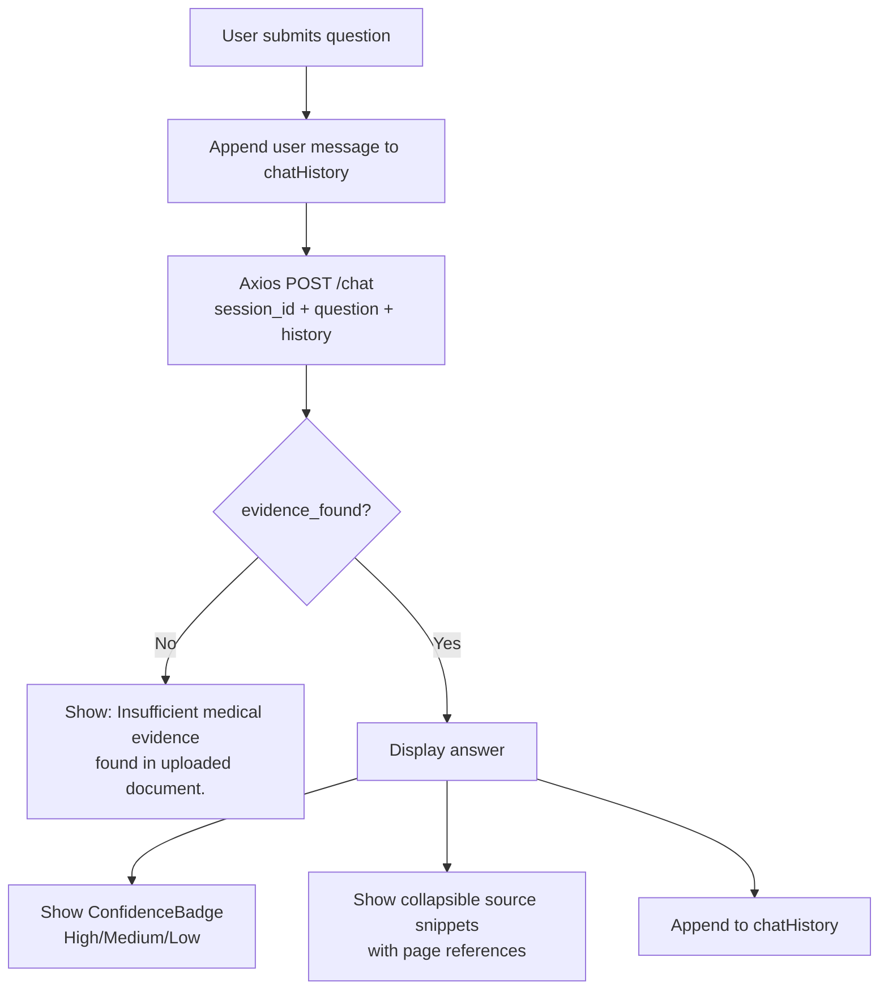

---

### 12.3 Medical Summary Page

**Purpose:** Structured display of extracted medical entities from `GET /summary`.

**Displays six categories in a card grid:**
- Diseases & Conditions
- Medications & Dosages
- Allergies
- Symptoms
- Abnormalities
- Recommendations

---

### 12.4 Source Evidence Viewer Page

**Purpose:** Shows all document chunks retrieved from `GET /sources` so the user can see exactly what the system indexed.

**Key behaviors:**
- Lists all chunks with chunk index and metadata
- Search/filter box to highlight specific terms
- Page reference metadata shown for each chunk

---

### 12.5 `api.js` — Axios API Layer

**Implementation:**

```javascript
// src/services/api.js

import axios from 'axios';

const BASE_URL = '/api';

export const uploadDocument = async (file, sessionId = null) => {
  const formData = new FormData();
  formData.append('file', file);
  if (sessionId) formData.append('session_id', sessionId);

  const response = await axios.post(`${BASE_URL}/upload`, formData);
  // Note: Do NOT set Content-Type — Axios sets multipart boundary automatically
  return response.data;
};

export const sendChat = async (sessionId, question, chatHistory = []) => {
  const response = await axios.post(`${BASE_URL}/chat`, {
    session_id: sessionId,
    question,
    chat_history: chatHistory,
  });
  return response.data;
  // Returns: { answer, confidence, sources, evidence_found }
};

export const getSummary = async (sessionId) => {
  const response = await axios.get(`${BASE_URL}/summary`, {
    params: { session_id: sessionId }
  });
  return response.data;
};

export const getSources = async (sessionId) => {
  const response = await axios.get(`${BASE_URL}/sources`, {
    params: { session_id: sessionId }
  });
  return response.data;
};

export const clearSession = async (sessionId) => {
  await axios.delete(`${BASE_URL}/session/${sessionId}`);
};
```

---

### 12.6 `AppContext.jsx` — Global State

**Implementation:**

```jsx
// src/context/AppContext.jsx

import { createContext, useContext, useState } from 'react';

const AppContext = createContext(null);

export function AppProvider({ children }) {
  const [sessionId, setSessionId] = useState(null);
  const [medicalData, setMedicalData] = useState(null);
  const [chatHistory, setChatHistory] = useState([]);
  const [isReady, setIsReady] = useState(false);
  const [sources, setSources] = useState([]);

  const handleUploadSuccess = (result) => {
    setSessionId(result.session_id);
    setMedicalData(result.medical_entities);
    setChatHistory([]);
    setIsReady(true);
  };

  const handleReset = () => {
    setSessionId(null);
    setMedicalData(null);
    setChatHistory([]);
    setIsReady(false);
    setSources([]);
  };

  const addMessage = (message) => {
    setChatHistory((prev) => [...prev, message]);
  };

  return (
    <AppContext.Provider value={{
      sessionId, medicalData, chatHistory, isReady, sources,
      setSources, handleUploadSuccess, handleReset, addMessage
    }}>
      {children}
    </AppContext.Provider>
  );
}

export const useApp = () => {
  const ctx = useContext(AppContext);
  if (!ctx) throw new Error('useApp must be used within AppProvider');
  return ctx;
};
```

---

## 13. Hybrid Retrieval Deep Dive

### Why Pure Vector Search Is Not Enough for Medical Text

```
┌────────────────────────┬────────────────────────┬────────────────────────┐
│  Query Type            │  FAISS Alone           │  FAISS + BM25 Hybrid   │
├────────────────────────┼────────────────────────┼────────────────────────┤
│  "what is the          │  ✅ Great — semantic    │  ✅ Great              │
│   patient's diagnosis" │  match works well       │                        │
├────────────────────────┼────────────────────────┼────────────────────────┤
│  "metformin 500mg"     │  ⚠️ May miss exact      │  ✅ BM25 finds exact   │
│                        │  drug name + dose       │  keyword match         │
├────────────────────────┼────────────────────────┼────────────────────────┤
│  "HbA1c levels Oct"    │  ⚠️ Dates/codes missed  │  ✅ BM25 matches       │
│                        │                         │  HbA1c exactly         │
├────────────────────────┼────────────────────────┼────────────────────────┤
│  "BP 140/90"           │  ❌ Numeric values       │  ✅ BM25 exact match   │
│                        │  poorly embedded        │                        │
└────────────────────────┴────────────────────────┴────────────────────────┘
```

Medical documents contain exact drug names, lab values, dosages, and clinical codes where keyword matching is essential. The hybrid approach captures both semantic meaning and exact terminology.

### Reranking Formula

```
combined_score = 0.6 × semantic_relevance
               + 0.4 × normalized_bm25_score
               + medical_term_bonus (max 0.1)

Where:
  semantic_relevance = 1 / (1 + faiss_l2_distance)
  normalized_bm25    = raw_bm25_score / max_bm25_in_result_set
  medical_term_bonus = count of shared medical terms × 0.05
```

---

## 14. Embedding Strategy — Voyage AI

### Why `voyage-large-3`

`voyage-large-3` is Voyage AI's highest-quality general embedding model. Compared to `voyage-3-lite` (v2) and `voyage-large-2` (interim):

```
┌──────────────────┬──────────────────┬──────────────────┬──────────────────┐
│  Model           │  Dimensions      │  Quality         │  Free Tier       │
├──────────────────┼──────────────────┼──────────────────┼──────────────────┤
│  voyage-3-lite   │  512             │  Good            │  200M tokens/mo  │
├──────────────────┼──────────────────┼──────────────────┼──────────────────┤
│  voyage-large-2  │  1536            │  Better          │  50M tokens/mo   │
├──────────────────┼──────────────────┼──────────────────┼──────────────────┤
│  voyage-large-3  │  1024            │  Best overall    │  50M tokens/mo   │
└──────────────────┴──────────────────┴──────────────────┴──────────────────┘
```

`voyage-large-3` produces the best semantic representations for medical terminology, making it the right choice for a system where retrieval accuracy is critical.

---

## 15. LLM Strategy — Groq + LLaMA 3 70B

### Why 70B over 8B

The 70B model produces significantly better:
- Structured JSON extraction (entities.py)
- Medical reasoning quality
- Instruction-following reliability for strict prompts

**Trade-off:** Lower rate limits on the Groq free tier — mitigated by the multi-key rotation system in `api_manager.py`.

```
temperature = 0      → entities.py (deterministic NER)
temperature = 0.1    → rag_pipeline.py (slightly natural responses)
max_tokens = 1000    → controlled response length
```

---

## 16. Multi-API Key Failover System

### Why It's Needed

The Groq free tier has per-minute token limits (TPM). With the 70B model these limits are lower than 8B. For demo scenarios with multiple uploads or rapid-fire questions, a single key can be exhausted quickly.

### How It Works

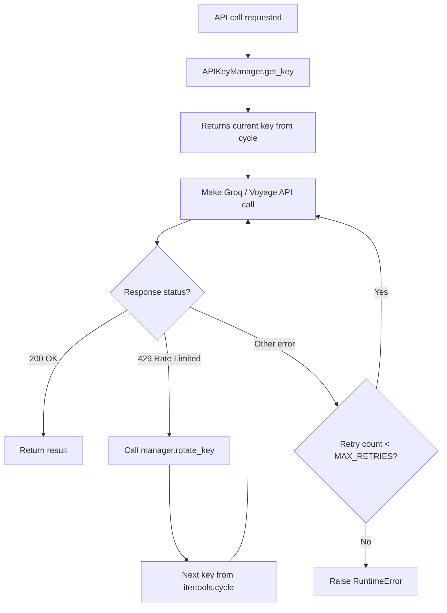

### Configuration

```env
# .env — comma-separated, no spaces
GROQ_API_KEYS=gsk_key1,gsk_key2,gsk_key3
VOYAGE_API_KEYS=pa_key1,pa_key2
```

With 3 Groq keys, you effectively triple the free tier capacity.

---

## 17. Confidence Scoring System

Every `/chat` response includes a confidence label based on retrieval quality.

```python
# Conversion: FAISS L2 distance → similarity
similarity = 1 / (1 + faiss_l2_distance)

# Thresholds
if avg_similarity > 0.80:  confidence = "High"
elif avg_similarity > 0.60: confidence = "Medium"
else:                        confidence = "Low"
```

**Frontend display:**

```
🟢 High Confidence   — answer strongly supported by document
🟡 Medium Confidence — answer partially supported
🔴 Low Confidence    — weak evidence, treat with caution
```

---

## 18. Safety & Hallucination Prevention

Three layers prevent hallucination:

**Layer 1 — Retrieval quality gate (`safety.py`)**
If retrieved chunks are too short or absent, the safety module blocks the LLM call entirely and returns the fallback message.

**Layer 2 — Strict prompting (`prompts.py`)**
The system prompt explicitly instructs the model to answer only from context and to return a standardised fallback if information is unavailable.

**Layer 3 — Temperature = 0.1**
Low temperature keeps the model deterministic and reduces creative embellishment.

**Fallback message (always displayed verbatim):**
```
Insufficient medical evidence found in uploaded document.
```

---

## 19. Prompt Engineering

All prompts are defined in `prompts.py` and imported by the modules that use them. This means any prompt change requires editing only one file.

### Contextualize Prompt (history-aware rephrase)
Used in `rag_pipeline.py` to rephrase follow-up questions into standalone queries.

### QA System Prompt
Strict grounding rules + context injection. Temperature 0.1.

### Extraction Prompt
Used in `entities.py`. Temperature 0 for deterministic entity extraction.

---

## 20. State Management — React Context

The app uses React's built-in Context API — no Redux or Zustand.

`AppContext.jsx` holds all global state:
- `sessionId` — current session identifier
- `medicalData` — extracted entities dict
- `chatHistory` — array of `{role, content}` messages
- `isReady` — gates navigation to Chat/Summary/Sources
- `sources` — document chunks from `/sources`

All pages access state via the `useApp()` hook. No prop drilling.

---

## 21. CORS & Local Networking

**Backend:** FastAPI CORS middleware allows requests from the React dev server:

```python
app.add_middleware(
    CORSMiddleware,
    allow_origins=["http://localhost:5173", "http://localhost:3000"],
    allow_methods=["*"],
    allow_headers=["*"],
)
```

**Frontend:** Vite dev server proxy rewrites `/api/*` → `http://localhost:8000/*`:

```js
server: {
  proxy: {
    '/api': {
      target: 'http://localhost:8000',
      changeOrigin: true,
      rewrite: (path) => path.replace(/^\/api/, '')
    }
  }
}
```

React makes requests to `/api/upload` (same origin → no CORS). Vite silently forwards to FastAPI.

### Team Network Access

```bash
# Backend accessible from LAN
uvicorn main:app --host 0.0.0.0 --port 8000

# Frontend accessible from LAN
npm run dev -- --host
```

Teammate accesses frontend at `http://<your-ip>:5173`.

---

## 22. Team Collaboration & GitHub Strategy

### Recommended Module Split (3 Developers)

```
┌──────────────────┬───────────────────────────────────────────────────────┐
│  Developer       │  Owns                                                 │
├──────────────────┼───────────────────────────────────────────────────────┤
│  Person 1        │  pdf_parser.py, ocr.py, chunking.py,                  │
│  (Doc Processing)│  entities.py, medical_summary.py                      │
├──────────────────┼───────────────────────────────────────────────────────┤
│  Person 2        │  embeddings.py, vector_store.py, hybrid_retrieval.py, │
│  (RAG + API)     │  reranker.py, rag_pipeline.py, confidence.py,         │
│                  │  safety.py, prompts.py, api_manager.py, main.py       │
├──────────────────┼───────────────────────────────────────────────────────┤
│  Person 3        │  All of frontend/: AppContext.jsx, api.js,            │
│  (Frontend)      │  Dashboard.jsx, ChatAssistant.jsx,                    │
│                  │  MedicalSummary.jsx, SourceEvidence.jsx,               │
│                  │  Navbar.jsx, ConfidenceBadge.jsx, SourceCard.jsx       │
└──────────────────┴───────────────────────────────────────────────────────┘
```

### Git Workflow

```bash
# Person 1
git checkout -b feature/document-processing

# Person 2
git checkout -b feature/rag-pipeline-api

# Person 3
git checkout -b feature/frontend
```

**Key rule:** Each person commits and pushes from their own machine with their own GitHub account. Never commit someone else's code.

### Integration Strategy

1. **Day 1 — Skeleton session (all 3 together):** Person 2 pushes `main.py` with dummy endpoint responses. Person 3 connects `api.js` to those endpoints. Agreement on request/response shapes.
2. **Build phase — independently:** Each person fills in their modules.
3. **Integration session:** Swap dummy responses for real ones. Usually 1–2 hours if Day 1 contract was followed.

---

## 23. Testing Protocol

### Test Dataset

1. Visit `https://mtsamples.com`
2. Download one Discharge Summary and one Cardiovascular Consult as PDFs
3. Save to `sample_data/`

### Full System Test Checklist

```
PHASE 1 — Backend Health
  [ ] cd backend && uvicorn main:app --reload runs without errors
  [ ] GET http://localhost:8000/health returns {"status": "ok"}
  [ ] GET http://localhost:8000/docs loads Swagger UI

PHASE 2 — Frontend Launch
  [ ] cd frontend && npm run dev runs without errors
  [ ] http://localhost:5173 loads the Dashboard
  [ ] Navbar shows all 4 pages (Chat, Summary, Sources locked until upload)

PHASE 3 — Document Processing
  [ ] Drop sample_discharge.pdf onto the upload zone
  [ ] Loading spinner appears
  [ ] Entity cards render on Dashboard with populated data
  [ ] Navbar links unlock (Chat, Summary, Sources)
  [ ] Backend terminal shows no unhandled exceptions

PHASE 4 — Hybrid Retrieval Verification
  [ ] POST /chat via Swagger with a drug name from the PDF
      Expected: BM25 should surface the exact chunk containing that drug
  [ ] POST /chat with a semantic question ("what is the patient's condition?")
      Expected: FAISS semantic match returns relevant diagnosis chunk

PHASE 5 — Confidence + Safety
  [ ] Ask a question clearly in the document
      Expected: confidence = "High", evidence_found = true
  [ ] Ask about something not in the document (e.g. "What is patient's shoe size?")
      Expected: "Insufficient medical evidence found in uploaded document."

PHASE 6 — Structured Summary
  [ ] Navigate to Medical Summary page
      Expected: Diseases, Medications, Allergies, Symptoms all populated

PHASE 7 — Source Evidence
  [ ] Navigate to Source Evidence page
      Expected: All indexed chunks displayed with metadata

PHASE 8 — Conversational Memory
  [ ] Ask: "What was prescribed for hypertension?"
  [ ] Follow up: "What is the dosage?"
      Expected: Correct dosage without re-stating the drug name (proves history-aware)

PHASE 9 — Multi-Key Failover
  [ ] Set GROQ_API_KEYS with 2+ keys in .env
  [ ] Trigger rate limit on key 1 (rapid uploads)
      Expected: System rotates to key 2 without crashing

PHASE 10 — Reset
  [ ] Click "New Document" / reset action
      Expected: All state clears, upload zone reappears, nav locks again
```

---

## 24. Known Gotchas & Fixes

### Gotcha 1 — `python-multipart` Missing

**Symptom:** FastAPI returns `422 Unprocessable Entity` on `/upload`.

**Fix:**
```bash
pip install python-multipart
```
Included in `requirements.txt` but easy to miss when installing manually.

---

### Gotcha 2 — Vite Proxy Not Working

**Symptom:** CORS errors or `ERR_CONNECTION_REFUSED` on `/api/*` calls.

**Fix — Check 1:** Confirm backend is running: `curl http://localhost:8000/health`

**Fix — Check 2:** Confirm proxy block in `vite.config.js` is correct.

**Fix — Check 3:** Restart Vite after editing `vite.config.js`.

---

### Gotcha 3 — Groq TPM Rate Limit (429)

**Symptom:** `groq.RateLimitError` on upload.

**Fix:** Add more keys to `GROQ_API_KEYS` in `.env`. The `api_manager` will rotate automatically. Also ensure `MAX_CHARS = 15000` truncation is active in `entities.py`.

---

### Gotcha 4 — EasyOCR First-Run Slow

**Symptom:** First OCR call takes 30–60 seconds.

**Cause:** EasyOCR downloads model weights on first use (~100MB).

**Fix:** Run one test OCR call during development setup so weights are cached. Subsequent calls are fast.

---

### Gotcha 5 — Session Not Found (404 on `/chat`)

**Symptom:** Chat returns `404: Session not found`.

**Cause:** FastAPI was restarted after upload. In-memory `session_store` was cleared.

**Fix:** Re-upload the document. Expected behavior for local development.

---

### Gotcha 6 — `langchain-voyageai` Import Error

**Symptom:** `ModuleNotFoundError: No module named 'langchain_voyageai'`

**Fix:**
```bash
pip install --upgrade langchain-voyageai langchain-core
```

---

### Gotcha 7 — Axios Multipart Upload Fails

**Symptom:** Backend receives empty file or `422` on `/upload`.

**Cause:** Manually setting `Content-Type: multipart/form-data` without the boundary string.

**Fix:** Never set `Content-Type` when using Axios with FormData. Axios sets it automatically with the correct boundary.

```javascript
// ✅ CORRECT
const response = await axios.post('/api/upload', formData);

// ❌ WRONG — breaks multipart boundary
const response = await axios.post('/api/upload', formData, {
  headers: { 'Content-Type': 'multipart/form-data' }
});
```

---

### Gotcha 8 — voyage-large-3 Model Not Found

**Symptom:** Voyage AI returns 404 or invalid model error.

**Fix:** Confirm `VOYAGE_MODEL = "voyage-large-3"` exactly in `embeddings.py`. Check Voyage AI docs for any model name updates.

---

## 25. AI Agent Prompts for Antigravity

Open this documentation file in Antigravity's context pane before running each prompt. Use sequentially.

### Prompt 1 — Project Scaffolding

```
Read the open documentation file (MEDICAL_AI_ASSISTANT_FINAL_DOCUMENTATION_v3.md).
Set up the complete project structure from Section 5.
1. Create backend/ with modules/ subdirectory and empty __init__.py files
2. Create backend/requirements.txt with exact contents from Section 6
3. Create backend/.env using the template from Section 8
4. Create frontend/ directory
5. In frontend/, run: npm create vite@latest . -- --template react
6. Install frontend deps as specified in Section 7
7. Create vite.config.js with the proxy configuration from Section 21
8. Configure Tailwind CSS as specified in Section 7
9. Create sample_data/ directory
10. Create .gitignore for both backend and frontend
Do not create any Python or JSX source files yet.
```

### Prompt 2 — Backend Modules (Person 1 scope)

```
Read the open documentation file, Sections 9.1 through 9.3 and 9.9 through 9.10.
Write these Python files in backend/modules/:
- pdf_parser.py (Section 9.1)
- ocr.py (Section 9.2)
- chunking.py (Section 9.3)
- entities.py (Section 9.9) — depends on medical_summary.py and api_manager.py stubs
- medical_summary.py (Section 9.10)
Follow each specification exactly. Handle all exceptions so no error propagates unhandled.
```

### Prompt 3 — Backend RAG + API (Person 2 scope)

```
Read the open documentation file, Sections 9.4 through 9.8 and 9.11 through 9.15.
Write these Python files in backend/modules/:
- api_manager.py (Section 9.14)
- embeddings.py (Section 9.4)
- vector_store.py (Section 9.5)
- hybrid_retrieval.py (Section 9.6)
- reranker.py (Section 9.7)
- rag_pipeline.py (Section 9.8)
- confidence.py (Section 9.11)
- safety.py (Section 9.12)
- prompts.py (Section 9.13)
Then write backend/main.py (Section 9.15).
Use GROQ_MODEL = "llama3-70b-8192" and VOYAGE_MODEL = "voyage-large-3" exactly.
```

### Prompt 4 — Frontend Context + API Layer (Person 3 scope)

```
Read the open documentation file, Sections 11, 12.5, and 12.6.
In frontend/src/:
1. Create context/AppContext.jsx from Section 12.6
2. Create services/api.js from Section 12.5
   - BASE_URL must be "/api" (Vite proxy handles routing)
   - uploadDocument: use FormData, do NOT set Content-Type header manually
   - sendChat: pass chat_history array in JSON body
   - getSummary and getSources: use Axios GET with params
```

### Prompt 5 — Frontend Pages (Person 3 scope)

```
Read the open documentation file, Sections 11 and 12.1 through 12.4.
In frontend/src/:
1. Create App.jsx with React Router DOM setup linking all 4 pages
2. Create layouts/MainLayout.jsx — shared page wrapper with Navbar
3. Create components/Navbar.jsx — navigation between pages, locks Chat/Summary/Sources
   until isReady is true (from AppContext)
4. Create components/ConfidenceBadge.jsx — renders High/Medium/Low with color coding
5. Create components/SourceCard.jsx — renders a single source chunk with metadata
6. Create pages/Dashboard.jsx — PDF drag-drop upload, entity card grid
7. Create pages/ChatAssistant.jsx — chat UI with ConfidenceBadge + SourceCard per message
8. Create pages/MedicalSummary.jsx — six-category structured summary grid
9. Create pages/SourceEvidence.jsx — all document chunks with search/filter
Use Tailwind CSS. Dark theme (bg-gray-950 base). Use useApp() hook for global state.
```

---

## 26. Limitations & Future Scope

### Current Limitations

```
┌──────────────────────────────────┬──────────────────────────────────────────────┐
│  Limitation                      │  Impact                                      │
├──────────────────────────────────┼──────────────────────────────────────────────┤
│  In-memory sessions              │  Lost on backend restart — re-upload needed  │
├──────────────────────────────────┼──────────────────────────────────────────────┤
│  Single document per session     │  Cannot query multiple records at once       │
├──────────────────────────────────┼──────────────────────────────────────────────┤
│  PDF only                        │  No DICOM, Word docs, HL7                    │
├──────────────────────────────────┼──────────────────────────────────────────────┤
│  Groq extraction truncation      │  First 15k chars only for NER — full doc     │
│                                  │  still searchable via RAG                    │
├──────────────────────────────────┼──────────────────────────────────────────────┤
│  No auth                         │  Anyone with localhost access sees all data  │
├──────────────────────────────────┼──────────────────────────────────────────────┤
│  EasyOCR CPU only                │  Slow on very large scanned documents        │
├──────────────────────────────────┼──────────────────────────────────────────────┤
│  Not clinically certified        │  Development and research use only           │
└──────────────────────────────────┴──────────────────────────────────────────────┘
```

### Future Improvements (Out of Scope — Documented for Reference)

- **FAISS disk persistence** — `vectorstore.save_local()` / `FAISS.load_local()` to survive restarts
- **Redis session store** — Replace in-memory dict for true statefulness
- **Multi-document sessions** — Per-patient index supporting record switching
- **Streaming responses** — SSE from FastAPI for token-by-token chat streaming
- **PostgreSQL persistence** — Store entities and chat history across sessions
- **Authentication** — JWT-based auth for multi-user scenarios

---

## Quick Reference

```
┌─────────────────────────────────────────────────────────────────────────────┐
│                    MEDICAL AI ASSISTANT v3 — QUICK REFERENCE               │
├─────────────────────────────────────────────────────────────────────────────┤
│                                                                             │
│  START BACKEND                                                              │
│  cd backend && source venv/bin/activate                                     │
│  uvicorn main:app --reload --host 0.0.0.0 --port 8000                      │
│                                                                             │
│  START FRONTEND                                                             │
│  cd frontend && npm run dev                                                 │
│                                                                             │
│  ACCESS                                                                     │
│  UI:        http://localhost:5173                                           │
│  API Docs:  http://localhost:8000/docs                                      │
│  Health:    http://localhost:8000/health                                    │
│                                                                             │
├─────────────────────────────────────────────────────────────────────────────┤
│                                                                             │
│  API KEYS (backend/.env)                                                   │
│  GROQ_API_KEYS=gsk_key1,gsk_key2      → console.groq.com                  │
│  VOYAGE_API_KEYS=pa_key1,pa_key2      → voyageai.com                       │
│                                                                             │
│  MODELS                                                                     │
│  LLM:        llama3-70b-8192 (Groq)                                        │
│  Embeddings: voyage-large-3 (Voyage AI)                                    │
│                                                                             │
├─────────────────────────────────────────────────────────────────────────────┤
│                                                                             │
│  BACKEND MODULES                                                            │
│  pdf_parser.py       → PDF bytes → raw text + quality flag                 │
│  ocr.py              → EasyOCR fallback for scanned PDFs                   │
│  chunking.py         → raw text → Document chunks (700/120)                │
│  embeddings.py       → Voyage AI voyage-large-3 wrapper                    │
│  vector_store.py     → FAISS index build + semantic search                 │
│  hybrid_retrieval.py → FAISS + BM25 parallel search + merge                │
│  reranker.py         → combined scoring → top-5 chunks                     │
│  rag_pipeline.py     → LangChain history-aware RAG chain                   │
│  entities.py         → Groq structured NER → MedicalSummary dict           │
│  medical_summary.py  → Pydantic MedicalSummary schema                      │
│  confidence.py       → similarity scores → High/Medium/Low                 │
│  safety.py           → evidence sufficiency validation                      │
│  prompts.py          → all LLM prompt templates                             │
│  api_manager.py      → multi-key rotation + failover                        │
│  main.py             → FastAPI routes + session store                       │
│                                                                             │
│  FRONTEND PAGES                                                             │
│  Dashboard.jsx       → PDF upload + entity cards                           │
│  ChatAssistant.jsx   → Q&A with confidence + source citations               │
│  MedicalSummary.jsx  → 6-category structured summary                       │
│  SourceEvidence.jsx  → all indexed chunks viewer                           │
│                                                                             │
│  API ENDPOINTS                                                              │
│  POST /upload        → process PDF, build indexes, extract entities         │
│  POST /chat          → hybrid RAG Q&A with confidence + sources            │
│  GET  /summary       → structured medical summary                          │
│  GET  /sources       → all document chunks                                 │
│  DELETE /session/id  → clear session                                       │
│                                                                             │
└─────────────────────────────────────────────────────────────────────────────┘
```

---

> **Medical Disclaimer:** This system is a development tool for AI research and document analysis. It is not certified for clinical use. All outputs must be reviewed by qualified healthcare professionals. Never use this system as the sole basis for clinical decisions.

---

*End of Documentation — v3*
