# Voice Integration — Branch Changelog

> **Comparison:** `main` → `Main_VoiceIntegrated`  
> **Repository:** [MedicalDocAIAssistant](https://github.com/Tumul001/MedicalDocAIAssistant.git)  
> **Branch URL:** https://github.com/Tumul001/MedicalDocAIAssistant/tree/Main_VoiceIntegrated  
> **Last updated:** May 2026

---

## Table of contents

1. [Overview](#overview)
2. [Visual guide (diagrams)](#visual-guide-diagrams)
3. [Commits](#commits-oldest--newest)
4. [Branch comparison](#what-main-has-vs-what-main_voiceintegrated-adds)
5. [Architecture & pipeline](#architecture--voice-pipeline)
6. [File changes](#file-changes-complete-list)
7. [Backend details](#backend--voice_handlerpy-core-addition)
8. [Frontend details](#frontend--voice-specific-behavior)
9. [Setup & deployment](#environment--setup-vs-main)
10. [Limitations](#known-limitations--follow-ups)

---

## Overview

`Main_VoiceIntegrated` adds **multilingual voice chat** (speech-to-text → RAG → text-to-speech) on top of the medical document assistant, plus a **full UI revamp** (dashboard, chat, upload, voice modal, theming). The `main` branch has none of this voice pipeline or the new voice-specific frontend modules.

| Metric | Value |
|--------|-------|
| Commits ahead of `main` | **7** |
| Files changed | **36** |
| Lines added | **~4,157** |
| Lines removed | **~1,274** |
| Net change | **~+2,883 lines** |

---

## Visual guide (diagrams)

Use this section first for onboarding. All diagrams use [Mermaid](https://mermaid.js.org/) (renders on GitHub, VS Code, Cursor, etc.).

### 1. Branch scope — what changed?

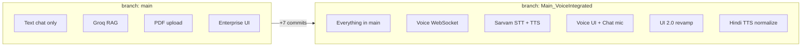

---

### 2. System context — who talks to whom?

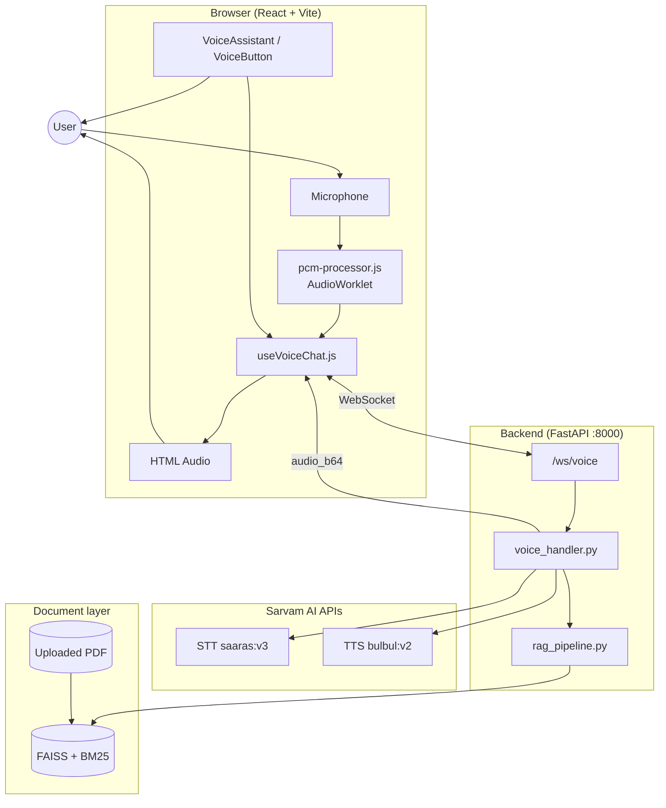

---

### 3. End-to-end sequence (one voice query)

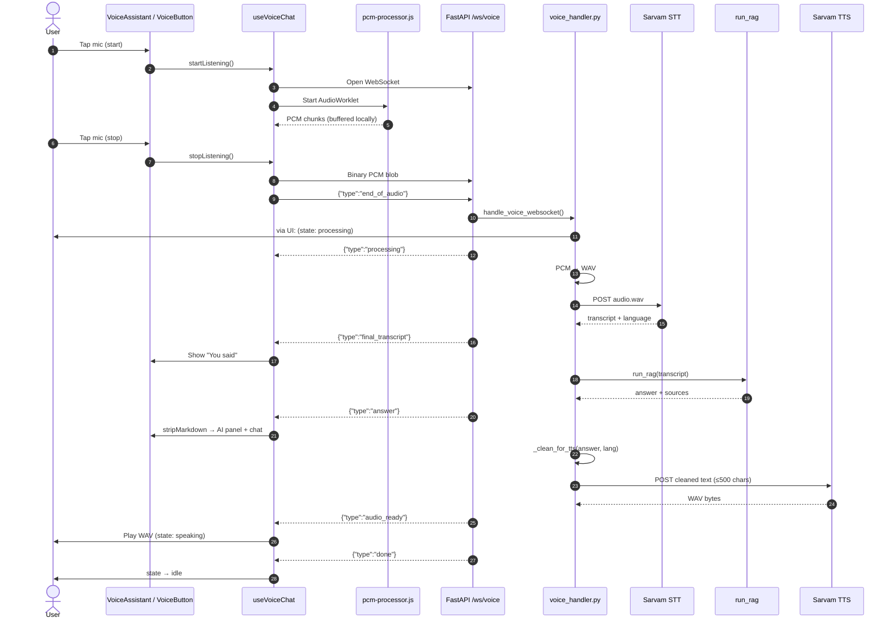

---

### 4. Frontend voice state machine

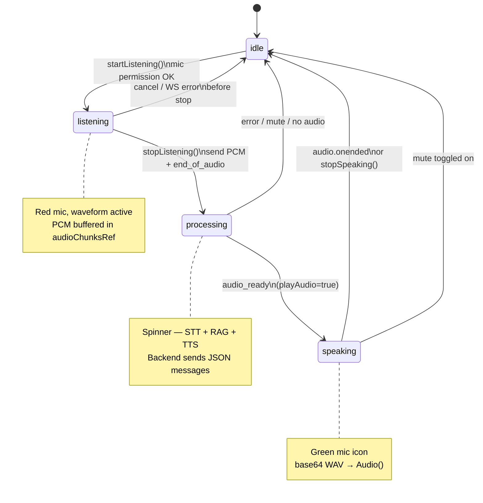

| State | UI color (typical) | User action |
|-------|-------------------|-------------|
| `idle` | Cyan mic | Tap to start |
| `listening` | Rose + pulse rings | Tap square to stop |
| `processing` | Violet spinner | Wait |
| `speaking` | Emerald | Wait or Cancel / Mute |

---

### 5. WebSocket message timeline

```mermaid
gantt
    title Backend → Frontend messages (typical happy path)
    dateFormat X
    axisFormat %s

    section Recording
    User speaks           :a1, 0, 3
    section Transfer
    PCM + end_of_audio    :a2, 3, 4
    section Backend
    processing            :crit, 4, 5
    final_transcript      :5, 7
    answer                :7, 12
    audio_ready           :12, 15
    done                  :15, 16
    section Frontend
    Show transcript       :milestone, 7, 0
    Show AI text          :milestone, 12, 0
    Play audio            :12, 15
```

| Order | `type` | Payload highlights |
|-------|--------|-------------------|
| 1 | `processing` | — |
| 2 | `final_transcript` | `text`, `language` (e.g. `hi`) |
| 3 | `answer` | `text` (raw markdown), `confidence`, `sources` |
| 4 | `audio_ready` | `audio_b64`, `format: "wav"` |
| 5 | `done` | — |

On failure at any step: `{"type":"error","message":"..."}` → frontend → `idle`.

---

### 6. Frontend component map

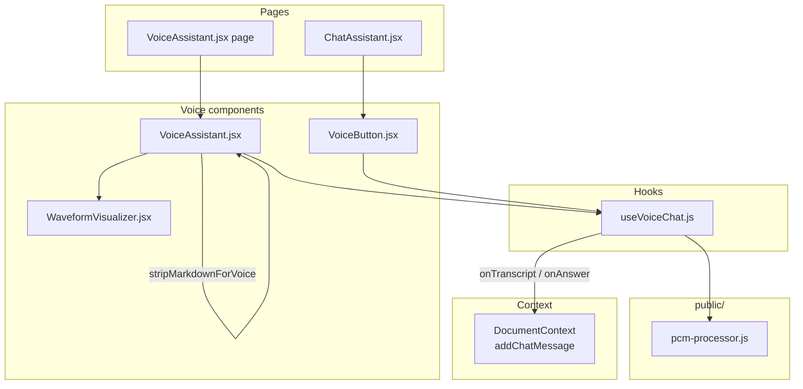

**Two entry points, one hook:** both `VoiceAssistant` (full modal) and `VoiceButton` (chat bar) share `useVoiceChat`.

---

### 7. Backend `voice_handler.py` flow

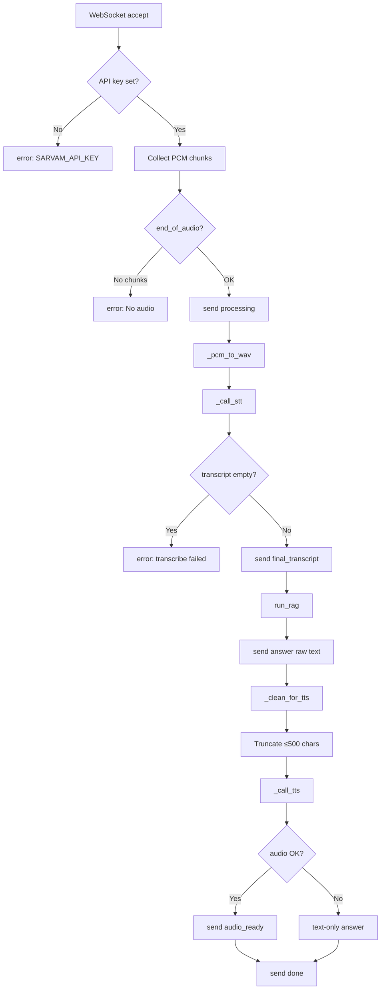

---

### 8. TTS text cleaning pipeline (`_clean_for_tts`)

Only runs on the **backend** before Sarvam TTS. Language = **STT-detected** code (e.g. `hi`).

```mermaid
flowchart TD
    IN[Raw RAG answer text] --> MD

    subgraph MD["Markdown strip"]
        M1[Links → text]
        M2[Bold/italic/code]
        M3[Headings & bullets]
        M4[Remove stray * # _ `]
    end

    MD --> NUM{_convert_numbers_for_tts}

    subgraph NUM["Number rules (Hindi only)"]
        N1[Line-start 1. 2. → ordinals]
        N2[62.1% → words + प्रतिशत]
        N3[Decimals → पॉइंट + digits]
        N4[Integers → Hindi words]
    end

    NUM -->|lang != hi| SKIP[Keep digits as-is]
    NUM -->|lang == hi| HI[Apply Hindi tables]
    SKIP --> WS
    HI --> WS

    WS[Collapse newlines & whitespace] --> OUT[tts_input → Sarvam]

    style HI fill:#1a3a2a
    style SKIP fill:#3a2a1a
```

**Parallel path (frontend UI only):**

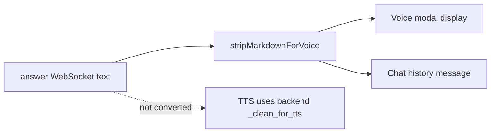

---

### 9. Audio capture path (browser)

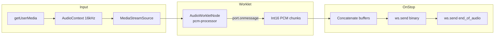

| Setting | Value |
|---------|-------|
| Sample rate | 16,000 Hz |
| Format | Signed 16-bit PCM, mono |
| Streaming STT | No — full buffer sent once |

---

### 10. Supported languages (STT detect → TTS voice)

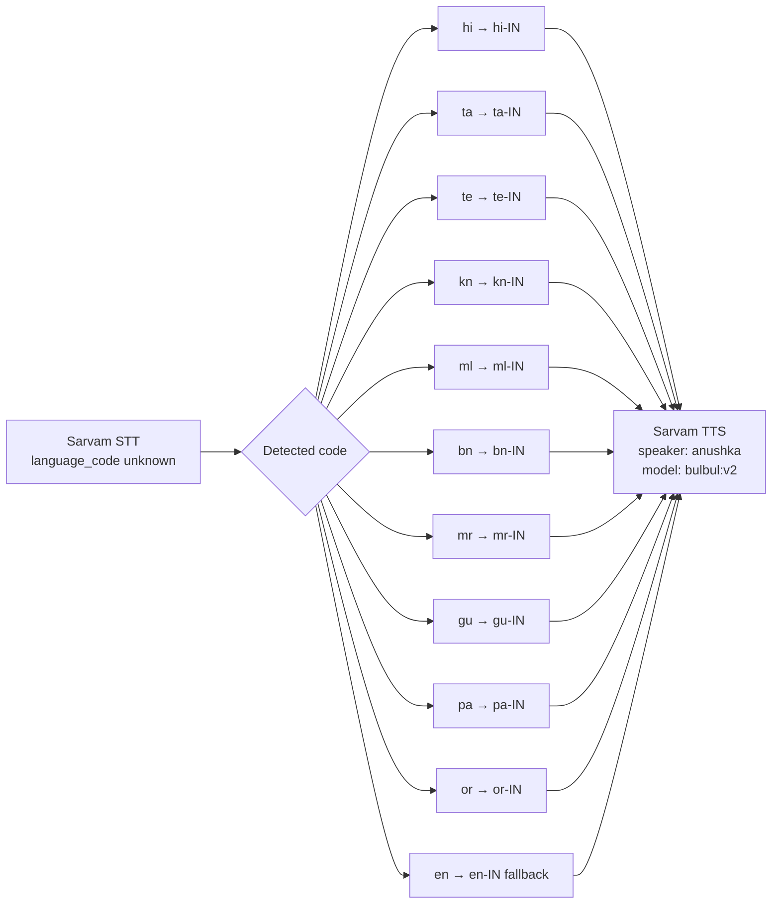

| Code | Language | Number→words in TTS |
|------|----------|---------------------|
| `hi` | Hindi | Yes |
| `ta`, `te`, `kn`, … | Other Indian langs | No (digits) |
| `en` | English | No |

---

### 11. UI 2.0 + voice entry points

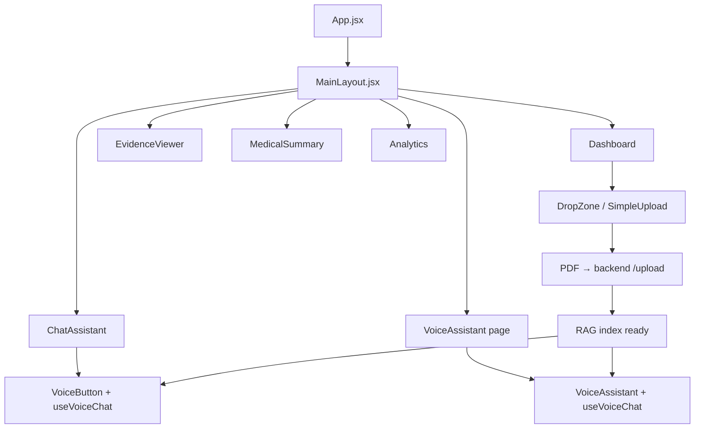

---

### 12. Local dev topology

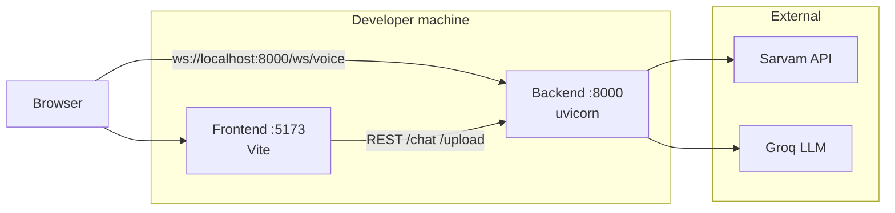

**CORS** (`main.py`): `http://localhost:5173`, `http://127.0.0.1:5173`

---

### 13. Commit timeline

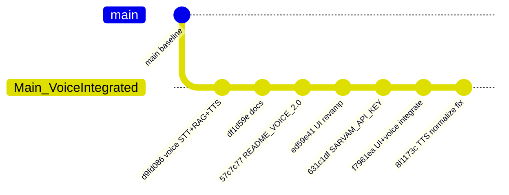

---

## Commits (oldest → newest)

| Commit | Summary |
|--------|---------|
| `d9fd086` | **feat: multilingual voice integration** — Sarvam STT (Saaras v3) + TTS (Bulbul v2), WebSocket `/ws/voice`, PCM capture via AudioWorklet, inline mic in chat |
| `df1d59e` | **docs:** comprehensive README for voice integration branch |
| `57c7c77` | **docs:** `README_VOICE_2.0.md` for frontend developer handoff |
| `ed59e41` | **feat: complete UI revamp** — new pages, layout, voice page, dashboard cards, upload drop zone |
| `631c1df` | **fix:** add `SARVAM_API_KEY` to `backend/.env.example` |
| `f7961ea` | **Integrate new UI with backend voice flow** |
| `8f1173c` | **Fix voice modal display and Hindi TTS normalization** — strip markdown in UI, Hindi number/ordinal/percent conversion for TTS |

---

## What `main` Has vs What `Main_VoiceIntegrated` Adds

### On `main` (unchanged baseline)

- Text-only chat over uploaded PDFs (Groq RAG)
- Enterprise-style UI (light/dark) without voice
- No Sarvam APIs, no WebSocket voice endpoint
- No mic capture or TTS playback

### On `Main_VoiceIntegrated` (new)

1. **End-to-end voice pipeline** (browser → backend → Sarvam → RAG → Sarvam → browser)
2. **Auto language detection** from speech (Hindi, Tamil, Telugu, Kannada, Bengali, Marathi, Gujarati, Punjabi, Odia, Malayalam, English)
3. **Dedicated voice UI** (modal component, waveform, state machine, mute/cancel)
4. **Inline voice in chat** (`VoiceButton` in chat input bar)
5. **TTS text normalization** (markdown strip, Hindi numbers/ordinals/percentages)
6. **UI 2.0** across dashboard, chat, evidence viewer, summary, analytics

See [§2 System context](#2-system-context--who-talks-to-whom) and [§3 Sequence diagram](#3-end-to-end-sequence-one-voice-query).

---

## Architecture — Voice Pipeline

High-level flow (ASCII fallback if Mermaid is unavailable):

```
User → Mic → pcm-processor.js → useVoiceChat (buffer) → WebSocket
  → voice_handler.py → Sarvam STT → RAG → _clean_for_tts → Sarvam TTS
  → audio_ready → Browser Audio → UI
```

### WebSocket messages (backend → frontend)

| Type | When | Fields |
|------|------|--------|
| `processing` | Audio received, work started | — |
| `final_transcript` | STT done | `text`, `language` |
| `answer` | RAG done | `text`, `confidence`, `sources` |
| `audio_ready` | TTS done | `audio_b64`, `format` (`wav`) |
| `done` | Session finished | — |
| `error` | Failure | `message` |

See [§5 Message timeline](#5-websocket-message-timeline) and [§4 State machine](#4-frontend-voice-state-machine).

---

## File Changes (complete list)

### New files (added on `Main_VoiceIntegrated`)

| Path | Purpose |
|------|---------|
| `backend/modules/voice_handler.py` | WebSocket handler, Sarvam STT/TTS, TTS text cleaning, Hindi number/ordinal conversion |
| `frontend/public/pcm-processor.js` | AudioWorklet: mic → 16-bit PCM chunks |
| `frontend/src/hooks/useVoiceChat.js` | Voice WebSocket client, recording buffer, playback |
| `frontend/src/components/voice/VoiceAssistant.jsx` | Full voice modal UI (mic, waveform, transcript, AI response, language hint) |
| `frontend/src/components/voice/WaveformVisualizer.jsx` | Animated bars while listening/speaking |
| `frontend/src/components/VoiceButton.jsx` | Compact mic control for chat input bar |
| `frontend/src/pages/VoiceAssistant.jsx` | Standalone voice page route |
| `frontend/src/components/chat/MessageBubble.jsx` | Chat bubbles with confidence/sources |
| `frontend/src/components/chat/TypingIndicator.jsx` | Assistant typing animation |
| `frontend/src/components/dashboard/InsightCards.jsx` | Dashboard metric cards |
| `frontend/src/components/dashboard/LanguageSelector.jsx` | UI language picker (hint only; voice uses STT detect) |
| `frontend/src/components/home/AdvancedPanel.jsx` | Advanced home panel with stats |
| `frontend/src/components/home/SimpleUpload.jsx` | Simplified upload entry |
| `frontend/src/components/upload/DropZone.jsx` | Drag-and-drop PDF upload |
| `frontend/src/hooks/useLocalStorage.js` | Persist UI preferences |
| `frontend/src/utils/formatters.js` | Date/text formatting helpers |
| `README_VOICE_2.0.md` | Earlier voice developer handoff doc (Antigravity/Stitch) |

### Modified files

| Path | What changed |
|------|----------------|
| `README.md` | Updated project overview for voice + new UI |
| `backend/main.py` | Registers `@app.websocket("/ws/voice")` |
| `backend/.env.example` | Documents `SARVAM_API_KEY` |
| `backend/requirements.txt` | Voice-related deps (e.g. `httpx` for Sarvam REST) |
| `backend/modules/confidence.py` | Grounding/scoring tweaks for voice answers |
| `backend/modules/prompts.py` | Minor prompt adjustments |
| `frontend/src/App.jsx` | Routes for voice page / layout |
| `frontend/src/layouts/MainLayout.jsx` | Navigation, voice entry points |
| `frontend/src/pages/ChatAssistant.jsx` | Voice button in chat, new message UI |
| `frontend/src/pages/Dashboard.jsx` | Insight cards, layout refresh |
| `frontend/src/pages/EvidenceViewer.jsx` | Styling and structure updates |
| `frontend/src/pages/MedicalSummary.jsx` | Summary layout alignment |
| `frontend/src/pages/Analytics.jsx` | Minor analytics UI sync |
| `frontend/src/components/SummarySection.jsx` | Summary component refresh |
| `frontend/src/context/ThemeContext.jsx` | Theme behavior updates |
| `frontend/src/index.css` | Global styles, voice animations, glass UI |
| `frontend/tailwind.config.js` | Extended colors, fonts, animations |
| `frontend/index.html` | Meta/title tweaks |
| `frontend/src/services/api.js` | Small API helper change |

See [§6 Component map](#6-frontend-component-map) and [§11 UI entry points](#11-ui-20--voice-entry-points).

---

## Backend — `voice_handler.py` (core addition)

**Not present on `main`.** ~440 lines implementing:

- **STT:** `POST https://api.sarvam.ai/speech-to-text` (model `saaras:v3`, auto language)
- **TTS:** `POST https://api.sarvam.ai/text-to-speech` (model `bulbul:v2`, speaker `anushka`)
- **Language map:** `hi`, `ta`, `te`, `kn`, `ml`, `bn`, `mr`, `gu`, `pa`, `or`, `en` → BCP-47 + speaker
- **TTS limit:** 500 characters per request (truncated at word boundary)

See [§7 Backend flow](#7-backend-voice_handlerpy-flow) and [§8 TTS cleaning](#8-tts-text-cleaning-pipeline-_clean_for_tts).

### `_clean_for_tts(text, language)` (latest behavior)

Applied **before** Sarvam TTS using language from **STT detection** (user’s spoken language):

1. **Markdown removal** — `*`, `**`, `#`, `` ` ``, links, bullets; newlines collapsed to pauses
2. **Hindi list ordinals** — line-start `1.` `2.` … → `पहला`, `दूसरा`, `तीसरा`, … (1–10 mapped; higher → `{number}वाँ`)
3. **Hindi numbers** — integers, decimals (`पॉइंट` + digit words), percentages (`प्रतिशत`)
4. **Non-Hindi languages** — numbers/ordinals left as digits (TTS may read in English)

Examples (Hindi, `language=hi`):

| Input | TTS-oriented output (conceptually) |
|-------|-----------------------------------|
| `**रोगियों की संख्या**` | `रोगियों की संख्या` |
| `605` | `छह सौ पाँच` |
| `62.1%` | `बासठ पॉइंट एक प्रतिशत` |
| `1. First point` | `पहला First point` |

---

## Frontend — Voice-specific behavior

### `useVoiceChat.js`

- Buffers PCM in browser (no streaming STT; single blob on stop)
- Connects to `ws://localhost:8000/ws/voice`
- Callbacks: `onTranscript`, `onAnswer`
- `playAudio` flag for mute (stops playback, skips auto-play)

### `VoiceAssistant.jsx`

- Language selector (UI hint only; detection shown after speak)
- **“You said”** transcript panel
- **“AI speaking / AI response”** panel with `stripMarkdownForVoice()` so `**bold**` does not show in the modal
- Mute, cancel, waveform, pulsing mic rings by state

### `VoiceButton.jsx`

- Inline mic in **Chat Assistant** input bar
- Same hook/pipeline, compact UX

### `pcm-processor.js`

- Must be served from `frontend/public/` (loaded as `/pcm-processor.js`)

---

## Environment & setup (vs `main`)

Add to `backend/.env` (see `.env.example`):

```env
SARVAM_API_KEY=your_sarvam_api_key_here
```

**Requirements:**

- Backend running on port **8000** (WebSocket URL hardcoded in `useVoiceChat.js`)
- Frontend dev server (e.g. Vite **5173**) with CORS allowed in `main.py`
- Microphone permission in browser
- Uploaded PDF before voice queries (UI enforces `documentLoaded`)

**Run:**

```bash
# Backend
cd backend && pip install -r requirements.txt && uvicorn main:app --reload

# Frontend
cd frontend && npm install && npm run dev
```

See [§12 Dev topology](#12-local-dev-topology).

### Troubleshooting quick reference

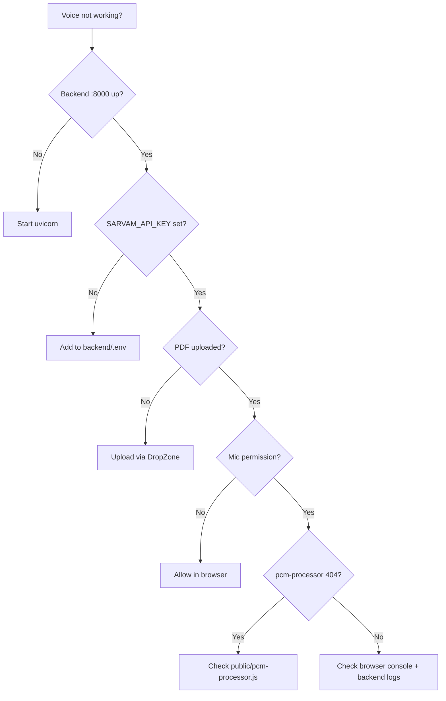

---

## UI revamp summary (beyond voice)

`Main_VoiceIntegrated` also refactors most of the app shell:

- **Dashboard** — insight cards, cleaner layout
- **Chat** — `MessageBubble`, typing indicator, voice mic in input
- **Upload** — `DropZone`, `SimpleUpload`
- **Evidence / Summary / Analytics** — visual alignment with new design system
- **Theming** — `index.css` + `tailwind.config.js` (glass panels, cyan/emerald/rose state colors)

---

## Known limitations & follow-ups

| Area | Status on `Main_VoiceIntegrated` |
|------|----------------------------------|
| Number → words | **Hindi only**; Tamil/Telugu/etc. still digit-based in TTS |
| Language for TTS | Uses **STT-detected** language, not a separate RAG response language field |
| Voice modal display | Markdown stripped; **numbers still shown as digits** in UI (only TTS gets word form) |
| TTS length | Answers truncated to **500 chars** for Sarvam |
| WebSocket URL | Fixed to `localhost:8000` — needs config for production deploy |
| `_old_clean_for_tts` | Legacy helper kept in `voice_handler.py`; production path uses `_clean_for_tts` |

---

## Developer cheat sheet

| I need to… | Open this file |
|------------|----------------|
| Change WS protocol / Sarvam calls | `backend/modules/voice_handler.py` |
| Register voice route | `backend/main.py` → `/ws/voice` |
| Change mic / playback behavior | `frontend/src/hooks/useVoiceChat.js` |
| Change voice modal UI | `frontend/src/components/voice/VoiceAssistant.jsx` |
| Change chat bar mic | `frontend/src/components/VoiceButton.jsx` |
| Fix PCM capture | `frontend/public/pcm-processor.js` |
| Fix markdown in UI only | `stripMarkdownForVoice()` in `VoiceAssistant.jsx` |
| Fix spoken numbers / TTS | `_clean_for_tts()` in `voice_handler.py` |

---

## Related documentation

- **`README_VOICE_2.0.md`** — Original frontend handoff for Voice 2.0 (branch name references `NewVoiceIntegration_T`; content largely applies to `Main_VoiceIntegrated`)
- **`README.md`** — Root readme updated on this branch

---

## Quick merge reference

To see the full diff locally:

```bash
git fetch origin
git diff origin/main...origin/Main_VoiceIntegrated
git log origin/main..origin/Main_VoiceIntegrated --oneline
```

To checkout the voice branch:

```bash
git checkout Main_VoiceIntegrated
```

---

## Summary

`Main_VoiceIntegrated` is **`main` + multilingual voice (Sarvam STT/TTS) + UI 2.0 + Hindi TTS normalization fixes**. The largest single addition is `backend/modules/voice_handler.py`; the main user-facing surfaces are `VoiceAssistant.jsx`, `useVoiceChat.js`, and `VoiceButton.jsx` in chat.

**For new developers:** start with [Visual guide §1–3](#visual-guide-diagrams) (branch scope, system context, sequence), then [§4 State machine](#4-frontend-voice-state-machine) and [Developer cheat sheet](#developer-cheat-sheet).
